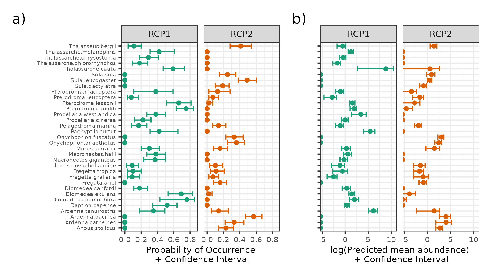

<!-- YAML for bookdown+lua edited following: -->

<!-- https://www.r-bloggers.com/2019/08/rmarkdown-template-that-manages-academic-affiliations-docx-or-pdf-output/ -->

```{r setup, include = FALSE, echo = FALSE}
library(readr)
library(dplyr)
library(purrr)
library(gt)
```

\pagebreak

# Introduction

Bioregionalization is the discipline that identifies, delimits, characterises, and names biogeographical regions [@vilhena2015; @morrone2018]. Although there is often no agreement on the naming systems between proposed regionalizations [but see @ebach2008], the hierarchical nature of bioregions is well recognized [@vilhena2015; @kreft2010]. Thus, bioregions are usually described within geographically larger classifications, such as 'provinces' or 'realms' [@spalding2007; @costello2017]. The delimitation of bioregions is made through identifying sets of species that are endemic or have high levels of co-occurrence, and are distinct enough from other regions. In this sense, bioregions are interpreted as a natural representations of common historical and/or ecological processes shaped by physical and biological forces [@kreft2010]. In particular, the identification of bioregions allows representation of the distribution of multiple species at a given time and space as well as relating these regions to environmental characteristics. By doing so, bioregions can be interpreted as species assemblages [@lyons2017; @hill2017]. Given these features, bioregions can be used as surrogates for biodiversity monitoring in data-poor regions and in regional conservation planning [@spalding2007; @ferrier2002a], playing a fundamental role in conservation biogeography [@whittaker2005].

Seabird assemblages have been widely described and related to environmental characteristics. Considering the hierarchical nature of oceanographic processes and their resulting features [@haury1978patterns], it is not surprising that the distribution of highly mobile seabirds are linked differently across scales [@hunt1987]. In the marine environment, large scale oceanographic features (e.g. water masses and currents) act as 'biomes' and influence seabird assemblage structure--i.e. the occurrence of species and their relative numerical composition [@ribic1997; @hyrenbach2007; @commins2014]. In contrast, local abundance is related to temporary processes that aggregate prey and therefore predators, such as fronts and eddies [@weimerskirch2007; @scales2014]. Such smaller-scale processes, although ephemeral, are primarily driven by physical and atmospheric forces, and are thus somewhat predictable in space and time, providing consistent feeding areas for marine predators when they occur [@davoren2013; @hazen2013]. Noticeably, sea surface temperature is a key driver of seabird distribution, at individual- and assemblage-levels, operating over a range of scales from large (e.g. water masses) to small (e.g. fronts) [@dunlop1988; @ribic1997; @quillfeldt2015]. Nonetheless, many regions still lack information regarding distribution of seabird species and how they assemble in space and time.

One area that could benefit from better understanding of seabird distributions is Australia, considered a world seabird hotspot [@karpouzi2007; @ramírez2017]. Given the region's importance for seabird diversity, there are surprisingly few studies on seabird distribution [@mott2018; @bernard2021]. Off northwest Australia, at-sea surveys, multivariate analyses [@dunlop1988] and ensemble species distribution models of species assemblages [@lavers2014] have shown that habitat use by tropical species is related to sea surface temperature and salinity. In particular, @dunlop1988 suggested that salinity is the main variable influencing species distribution in oceanic waters whereas temperature is the key factor on the continental shelf. In contrast, there are few studies at large scales off eastern Australia. @reid2000 and @evans2021a analysed seabird assemblages and their relationships with oceanography and prey data at broad scales (tens of km), off southeast Tasmania. The remaining studies are mostly descriptive accounts at local scales [e.g. @norman1992distribution; @blaber1994distribution], or focused on a single species [e.g. @priddel2014].

The East Australian Current (EAC) is the major western boundary current in the South Pacific, and the dominant current in eastern Australia [@ganachaud2014]. The EAC has been extensively studied, although its link between oceanography and biological processes is still in its infancy. The dynamic features caused by the EAC, such as eddies and upwellings, are likely to influence marine biota [@suthers2011; @scales2014]. While most of the biological studies done in this system were focused on plankton entrapment within the cores of eddies [@garcia2022; @firme2023; @hassler2011], there is a growing body of work focusing on fisheries [e.g. @hobday2010; @young2011; @brieva2015]. These studies emphasize how the probability of occurrence of a given taxon, and the structure of species assemblages, is driven by the EAC. Notwithstanding, the relationship between oceanography and marine megafauna along the EAC is poorly known [@suthers2011]. Some progress has been made using shark and ray movement data [@jaine2014; @niella2020; @niella2022], and satellite tracking has also demonstrated that increased sea surface temperature in EAC decreases penguin foraging success [@carroll2016]. However, information at the assemblage-level is still scarce [but see @evans2021a].

Marine species range shifts are more likely to occur faster than terrestrial species due to their higher sensitivity to warming [@pinsky2019; @lenoir2020]. As a result, climate change is rearranging the structure of species assemblages around the globe [@poloczanska2013; @antão2020; @dornelas2014]. Top predators, for instance, may change their core habitats [@hazen2013a; @reisinger2022], with unprecedented population consequences. For seabirds, @péron2010 showed that sea surface temperature anomalies affected the occurrence and abundance of albatrosses and petrels species along a latitudinal range in the Indian Ocean, thus affecting assemblage structure. In eastern Australia, changing EAC conditions have affected a range of species. Changes in zooplankton assemblage structure and fish distribution patterns have been recorded, and shark distribution shifts are expected to occur [@johnson2011; @niella2022]. One of the strongest marine heatwave ever recorded, in the Tasman Sea, showed drastic environmental impacts [@oliver2017]. Therefore, given that the EAC is strengthening and getting warmer [@cai2005; @phillips2022], biological changes are expected to occur [@poloczanska2007; @hobday2010].

Given east Australia's importance for seabirds and the recent attention on how climate change in the EAC can affect marine biota [@poloczanska2007], an assessment of the spatial distribution of seabirds at large scales is timely. Seabirds can serve as sentinels for tracking ecological changes in the EAC in many ways [e.g. @sydeman2012]. Surprisingly, though, seabird distribution is under-represented in climate change studies, despite being highlighted as a priority topic [@grémillet2009; @sydeman2012]. In this study, we aim to identify assemblages of seabird species probabilistically and relate them to environmental conditions, by using at-sea surveys data and a state-of-the-art modelling technique. We used the mixture-model Region of Common Profiles [RCP; @foster2013], regarded as one of the best available tools for describing bioregions [@hill2020; @woolley2020]. RCP is a model-based approach, and has a range of advantages over traditional algorithm-based statistics [@warton2015; @hill2020]. East Australia supports a high diversity of seabirds and offers wide environmental gradients, from the tropics to the subantarctic. Therefore, we expect to find different assemblages relating to different environmental conditions. In addition, we run RCP models for presence-absence and abundance as input data, to test if the different numeric resolution would result in similar assemblage patterns. Furthermore, we provide a repeatable framework on which future studies can build to assess how changes in the EAC will influence the distribution of seabird assemblages.

# Methods

## Study area

The EAC originates from the South Equatorial Current (SEC), a tropical, nutrient-poor water. When the SEC's North Caledonian Jet hits the Queensland Plateau (\~18°S), it splits into a north branch running towards the Gulf of Papua and a south branch, which marks the start of the EAC [@kessler2013; @ganachaud2014]. The South Caledonian Jet completes the EAC system at \~22°S after encountering the shelf break in the southern portion of the Great Barrier Reef (**Fig. 1a**; @kessler2013; @ganachaud2014). **SST/SSS characteristics? ROB?** The EAC interacts with the topography of the seafloor, giving rise to oceanographic features and processes, such as smaller currents, upwellings, and persistent dynamic eddies [@oke2000; @ridgway2003a; @oke2019]. The EAC is mainly attached to the shelf break, but at \~32°S it spawns an area of eddy generation that dissipates throughout the western Tasman Sea [@mata2006; @oke2019], the 'EAC eastern extension' (@oke2019a; often termed the 'Tasman Front'). Although most EAC energy is converted into eddies, the EAC still runs southwards following the shelf break towards Tasmania (the 'EAC southern extension'; **Fig. 1a**), possibly carrying eddy-like features as a transient current [@oke2019].

## Seabird and environmental data sources

Seabird data were gathered aboard RV Investigator and RV Falkor during 15 voyages, between 2016--2021, over \~37° of latitude (**Fig. 1b**; **Table S1**). One observer continuously recorded seabirds within a 300-m forward quadrant (eye height **18-m, Eric?** a.s.l) throughout daylight hours while the ship was underway at a constant speed. The species, the number of birds per group, and behaviour were logged directly into a data entry system through a ship-based web server. Individual records received a date/time/geographic coordinate label (multi-species records have the same label but are logged as separate entries for each species) **(Eric: is there any ref for the protocol?)**. Birds following the boat were previously excluded from analyses.

```{r fig1-study-area, fig.cap = "**FIGURE 1.** Study area showing the main ocean currents (a), and seabird records made by season on top of the 1° latitude × 1° longitude grid cells (b). In (a), the East Australian Current (EAC) system is highlighted with its acronyms in bold and drawn in blue. The South Equatorial Current (SEC) and its branches, the North Caledonian Jet (NCJ) and South Caledonian Jet (SCJ), are drawn in red. The EAC 'eastern extension' is an eddy field (blue shaded area) often called the 'Tasman Front', from which the East Auckland Current originates (EAUC, in green). Figure (a) is adapted after Oke, Roughan, et al. (2019); for colour references see the online version.", fig.align = "center", echo = FALSE}

# knitr::include_graphics("../results/Fig1_study-area-w-oceanogr.png")

knitr::include_graphics("../EDA/Fig1-study-area-raw-counts.png")
```

To explain and predict species distribution and biogeography, a thoughtful choice of covariates is important [@barbet-massin2014]. We used three physiographic variables and seven oceanographic variables, from which a further three climatic layers were calculated (**Table 1**). These variables are the most used in seabird-environment relationship studies [@tremblay2009], capturing processes at a range of scales from large-scale water-mass properties (e.g. sea surface temperature) to prey availability in mesoscale oceanographic features (e.g. fronts and eddies; @weimerskirch2007; @scales2014). Seabird records were matched with the best open-access, remote-sensed or interpolated data available, and distance from the coast was calculated in R software, version 4.2.0 [@r2022] (see details below).

```{r table1, echo = FALSE}

data.frame(
  Variable = c("Sea Surface Temperature", "Sea Surface Temperature gradient", "Sea Surface Salinity", "Mixed Layer Depth", "8-day average Chlorophyll-a", "Log10 8-day average Chlorophyll-a", "Eddy Kinetic Energy", "Climatic mean EKE", "Climatic standard deviation EKE", "Climatic mean SSTgrad", "Bathymetry", "Slope", "Distance from coast"),
  Abbreviation = c("sst", "sst_grad", "sss", "mld", "chl8", "log10_chl8", "eke", "clim_eke_mean", "clim_eke_sd", "clim_sst_grad", "bat", "slope", "dist_coast"),
  Units = c("°Celsius", "delta-°Celsius", "PSU", "m", "mg/m^3", "log10(chl8)", "m/s", "mean(m/s)/season/10 years", "sd(m/s)/season/10 years", "mean(delta-°Celsius)/season/10 years", "m", "degrees", "km"),
  `Spatial resolution` = c("0.25° × 0.25°", "0.25° × 0.25°", "0.083° × 0.083°", "0.083° × 0.083°", "0.036° × 0.036°", "0.036° × 0.036°", "0.2° × 0.2°", "0.2° × 0.2°", "0.2° × 0.2°", "0.25° × 0.25°", "0.004° × 0.004°", "0.004° × 0.004°", "NA"),
  `Temporal resolution` = c("daily", "daily", "daily", "daily", "8-days composite", "8-days composite", "daily", "seasonal climatology", "seasonal climatology", "seasonal climatology", "NA", "NA", "NA"),
  Source = c("Huang et al. (2021)", "Derived from Huang et al. (2021)", "E.U. Copernicus Marine Service Information", "E.U. Copernicus Marine Service Information", "ERDDAP/NOAA", "Derived from ERDDAP/NOAA", "IMOS/AODN", "Derived from IMOS/AODN", "Derived from IMOS/AODN", "Derived from Huang et al. (2021)", "GEBCO", "Derived from GEBCO", "Calculated in R (see main text)")
) |>
  gt::gt() |>
  ## SST & SSTgrad
  gt::tab_footnote(footnote = 
                     gt::md("[NOAA OISST](https://psl.noaa.gov/data/gridded/data.noaa.oisst.v2.highres.html)"),
                   locations = gt::cells_body(columns = Source, rows = c(1:2, 10))) |>
  ## SSS & MLD
  gt::tab_footnote(footnote = 
                     gt::md("2011--2019: [GLOBAL_MULTIYEAR_PHY_001_030](https://doi.org/10.48670/moi-00021); 2020--2021: [GLOBAL_ANALYSIS_FORECAST_PHY_001_024](https://doi.org/10.48670/moi-00016)"),
                   locations = gt::cells_body(columns = Source, rows = 3:4)) |>
  ## CHL8 & log10-CHL8
  gt::tab_footnote(footnote = 
                     gt::md("[ERDDAP/NOAA](https://coastwatch.pfeg.noaa.gov/erddap/griddap/erdMH1chla8day.html)"),
                   locations = gt::cells_body(columns = Source, rows = 5:6)) |>
  ## EKE and derivations
  gt::tab_footnote(footnote = 
                     gt::md("[IMOS/AODN](https://portal.aodn.org.au/search), 'OceanCurrent - Gridded sea level anomaly - Delayed mode' data set"),
                   locations = gt::cells_body(columns = Source, rows = 7:9)) |>
  ## GEBCO & slope
  gt::tab_footnote(footnote = 
                     gt::md("[GEBCO](https://www.gebco.net/data_and_products/gridded_bathymetry_data/)"),
                   locations = gt::cells_body(columns = Source, rows = 11:12)) |>
  ## Improve cols names
  gt::cols_label(
    Variable = gt::md("**Variable**"),
    Abbreviation = gt::md("**Abbreviation**"),
    Units = gt::md("**Units**"),
    `Spatial.resolution` = gt::md("**Spatial resolution**"), 
    `Temporal.resolution` = gt::md("**Temporal resolution**"),
    Source = gt::md("**Source**")) |>
  ## Table title
  gt::tab_header(title = gt::md("**TABLE 1.** Environmental data used in the Region of Common Profile models applied to seabird data off eastern Australia, their spatial/temporal resolutions, units, and sources."))

```

## Data treatment

Data wrangling, modelling and visualization were done in R 4.2.0 [@r2022], using packages 'plyr' 1.8.8 [@plyr], 'dplyr' 1.1.2 [@dplyr], 'tidyr' 1.3.0 [@tidyr], 'readr' 2.1.4 [@readr], 'tibble' 3.2.1 [@tibble], 'lubridate' 1.9.2 [@lubridate], 'stringr' 1.5.0 [@stringr], 'purrr' 1.0.1 [@purrr], 'ggplot2' 3.4.2 [@ggplot2], 'ggspatial' 1.1.7 [@ggspatial], 'patchwork' 1.1.2 [@patchwork], 'RColorBrewer' 1.1-3 [@rcolorbrewer], 'rnaturalearth' 0.3.2 [@rnaturalearth], 'sp' 1.6-0 [@sp1; @sp2], 'sf' 1.0-8 [@sf], 'mapview' 2.11.0 [@mapview], 'raster' 3.5-21 [@raster], 'terra' 1.6-7 [@terra], 'rerddap' 1.0.2 [@rerddap], 'rerddapXtracto' 1.1.4 [@rerddapXtracto], 'hadsstR' [@hadsstr], 'corrplot' 0.92 [@corrplot2021], 'iNEXT' 3.0.0 [@chao2014; @hsieh2016], and 'ecomix' 1.0.0 [@ecomix]. Code and the modelling dataset (see \@ref(modellingdatasets)) are available in **Daudt et al. 2023 (Zenodo repo)**.

### Environmental layers

Spatial and temporal persistence of features such as eddy kinetic energy (eke) and thermal fronts (sea surface temperature gradient; sst_grad) may influence the movement and distribution of seabirds by offering a higher likelihood of finding food [@weimerskirch2007; @scales2014a]. Therefore, before extracting environmental data for each seabird record, 'eke' and 'sst_grad' environmental layers were calculated. For both, 'eke' and 'sst_grad', we used their original cell spatial resolution (**Table 1**) and calculations were done layer-by-layer to match seabird data on the finest scale possible. Eddy kinetic energy was calculated as $0.5 (u'² + v'²)$, where $u' = u - \bar{u}$ and $v' = v - \bar{v}$ are the surface zonal (latitudinal) and meridian (longitudinal) geostrophic currents, respectively, using a rolling mean of 90 days as $\bar{u}$ and $\bar{v}$ (**ROB: Ref here?**). The spatial 'sst_grad' for each cell was calculated by averaging the maximum value for each neighbouring cell (average neighbourhood maximum), from north-to-south (NS) and west-to-east (WE); then, the magnitude of the gradient was defined as $NS² + WE²$ [@burrows2011]. In addition, we calculated climatic seasonal average layers for 'eke' and 'sst_grad' based on 10-years of data (2011--2021) as a proxy for persistent oceanographic features, as well as 'eke' standard deviation over the same period (named with the prefix 'clim\_' in **Table 1**). Seabed slope was calculated using 'raster::terrain()', and distance from the coast was calculated through 'sf::st_distance()' using Australia and Tasmania as the mainland (i.e. ignoring smaller islands). Then, for each seabird record, the most proximate value for each environmental layer (original or calculated) was extracted using built-in functions from 'raster', 'terra', and 'sf' packages.

### Modelling datasets {#modellingdatasets}

Seabirds are highly mobile animals, and many species migrate during non-breeding periods [@biology2002]. Therefore, seasonal differences in species composition were expected [e.g. @reid2023], as well as in probability of occurrence and total numbers. Thus, we build separate modelling dataset for each season. We aggregated seabird data by 1° latitude $\times$ 1° longitude grid cells (c. 110 $\times$ 110 km) and season (**Fig. 1b**), by summing seabirds from the same species. Considering our aim to test if presence-absence and abundance (count) data would result in similar assemblage patterns, we built two species matrices, where the presence-absence matrix transformed values \>1 to 1. Furthermore, to avoid numerical instabilities in the models prompted by unusual or rare species, we kept only species occurring in at least six grids within each season (summer = 12 species; autumn = 21; winter = 20; spring = 33). The associated environmental data of each seabird record were averaged within the same grid cells and seasons. Environmental data were scaled and centred before modelling.

## Statistical modelling

We used the mixture model Region of Common Profiles (RCP) to identify and describe seabird assemblages. RCP is a one-stage bioregionalization approach, as it identifies bioregions by specifying a statistical model that simultaneously relates response (multi-species data) and predictor (environmental data) [@woolley2020; @hill2020]. The model defines 'regions' of similar environmental spaces in which the probability of observing a set of species 'profiles' is constant but different from other regions [@foster2013; @foster2017]. As such, RCPs can be directly interpreted as assemblages, and their species profiles as the assemblage structure. RCP memberships are latent (unobserved) and vary as a function of environmental data, assuming sites within each RCP have constant species profiles. Given a set of environmental variables, the model also enables prediction of assemblage probabilities onto sites where no biotic data exist. Additionally, as a feature of model-based approaches, RCPs allow the opportunity to compare models through information criteria, present uncertainty around the results, and check for model assumptions through assessing distribution of residuals [@warton2015; @hill2020].

Before fitting models, covariates were checked for collinearity within each seasonal modelling dataset. If a pairwise collinearity of $\left|x\right| >0.7$ was found we removed one of the variables [@dormann2013], favouring direct measures over the 'climatic' layers we calculated (e.g. if 'sst_grad' and 'clim_sst_grad' were correlated, we chose 'sst_grad'). Thus, 'full models' differed between seasons as the retained covariates varied, although most covariates were common for all seasons.

Due to seabird migration, seasons could act as 'sampling artifacts' [@foster2017], thus biasing results [@ponti2023]. Given the difference among seasons in the number of species that met our occurrence threshold (see \@ref(modellingdatasets)), we decided to run RCP models separately by season and data type (presence-absence and abundance). RCP models were used to relate the response variables (i.e. presence-absence or abundance of each seabird species in each grid cell) to the independent predictor covariates (i.e. averaged values of environmental variables in each cell). Presence-absence data were modelled based on a Bernoulli error distribution, whereas abundance data based on a Negative Binomial error distribution. RCPs were fitted using the 'ecomix' package [@ecomix], with the following workflow: (i) find the best number of groups that describes the data, (ii) re-fit the model by fixing the best number of groups and selecting optimal combination of covariates, (iii) check residuals, (iv) bootstrap the best model to estimate uncertainty around parameter estimates, and (v) produce results.

To identify the best number of groups that described the data, we ran full models (all covariates) with 100 random start numbers [see @foster2013] between 2--7 groups, and chose the number of RCPs that minimized the Bayesian Information Criterion (BIC). Then, we fixed the number of groups at the optimal number and fitted models for every possible linear, additive combination of covariates. We chose the best model as the one with the lowest BIC. Visual inspection of randomized quantile residual plots modified for mixture models was used to verify model assumptions [@dunstan2013]. To obtain estimates of uncertainty for model parameters (confidence intervals), we used the default settings of 'ecomix::regional_mix.bootstrap()', which applies a Bayesian bootstrap 1000 times. A custom code was written to generate partial plots for exploring the influence of covariates on RCP membership.

We built a seasonal 10-year (2011--2021) average layer for predicting model results for each environmental covariate. These variables were then averaged within 1° latitude $\times$ 1° longitude grid cells, by season, between 9--47°S and 141--161°E. Note that 'clim_eke_mean' and 'clim_sst_grad' were processed beforehand as they may characterise persistent oceanographic features (described above) and thus represent the same value as 'eke' and 'sst_grad'. Data for prediction were scaled and centred using the same coefficients from the modelling dataset.

Additionally, to investigate if the amount of information used to run the RCP models was representative, we ran rarefaction curves based on the presence-absence matrix and the assigned RCP group for each sample (grid cell). Rarefaction curves were fit using the 'iNEXT' package, and results are presented based on alpha diversity (i.e. species richness).

# Results

## Summary of species richness and numbers

A total of 10,261 seabird records were obtained during the 15 voyages, comprising 142,646 individuals from 80 species, belonging to 11 families and five orders. The five most abundant species made up 83% of total birds counted (43.0% *Ardenna tenuirostris*, 17.2% *Pachyptila turtur*, 14.3% *Ardenna pacifica*, 5.2% *Onychoprion fuscatus*, 3.2% *Thalassarche cauta*). The five most frequently encountered species were *Ardenna pacifica* (frequency of occurrence = 35.3%), *Thalassarche cauta* (33.2%), *Sula leucogaster* (25.4%), *Sula sula* (25.4%) and *Thalassarche melanophris* (25%) (**Fig. S1**). An increase in species richness towards the south of the study region was clear in all but the winter season (**Fig S2**). Noticeably higher counts were made around Tasmania, possibly due to the 'colony effect' (**Fig. S2**). However, one cell in the Coral Sea had counts of the same order of magnitude as off Tasmania in summer.

## RCP models

For all models two RCPs was the optimal number of groups, except for presence-absence-autumn, which indicated three RCPs as the best fit (**Fig S3**). The best fitting models generally had 1 or 2 covariates selected, although the abundance-autumn model had five covariates (**Table 2**). The best models showed a good fit with no apparent deviations from the assumptions (**Fig. S4**). All the best models selected 'sst' or 'sss', variables essential for characterising water masses. The probability of belonging to one or another RCP varied its 'sst' threshold between 18--21°C, or 'sss' 35.1 PSU for summer (**Fig. 4**, **Fig. S6**), similar to EAC's temperature and salinity thresholds. Furthermore, most of the best models selected 'bat', suggesting a gradient between 'coastal' and 'oceanic' taxa (**Fig. S6**). Interestingly, proxies for persistent oceanographic features that may aggregate food resources (the 'climatic' variables) were selected only in autumn and spring abundance models.

```{r table2, echo = FALSE, message = FALSE}

df <- 
  rbind(
    list.files(path = "../results/Bernoulli", pattern = "*04_full_and_best_models.csv", full.names = TRUE),
    list.files(path = "../results/NegBin", pattern = "*04_full_and_best_models.csv", full.names = TRUE)) %>% 
  purrr::map_df(~readr::read_csv(.)) %>% 
  dplyr::select(- `...1`) %>% 
  dplyr::mutate(data_type = factor(data_type, levels = c("bernoulli", "neg_bin")),
                season = factor(season, levels = c("summer", "autumn", "winter", "spring")),
                model = factor((ifelse(model == "full", "a", "b")), levels = c("a", "b")),
                bic = round(bic, digits = 2)) %>%
  dplyr::group_by(data_type) %>% 
  dplyr::arrange(data_type, season) %>% 
  as.data.frame(.) %>% 
  dplyr::ungroup(.)

# Correct a value in a cell
# Full abundance-autumn model did not fit properly, returning a value of -Inf
df[df$data_type=='neg_bin' & df$season=='autumn' & df$model=='a',]$bic <- "-Inf (n.f.)"

# A few tweaks to make the table look better
df$data_type <- c("Bernoulli", rep("", 7), "Negative Binomial", rep("", 7))
df$season <- rep(c("Summer", "", "Autumn", "", "Winter", "", "Spring", ""), 2)

gt::gt(df)|>
  ## Improve cols names
  gt::cols_label(
    data_type = gt::md("**Data type**"),
    season = gt::md("**Season**"),
    model = gt::md(" "),          ## To be excluded in the Word doc
    model_specification = gt::md("**Model specification**"), 
    bic = gt::md("**BIC**")) |>
  ## Table title
  gt::tab_header(title = gt::md("**TABLE 2.** Full (a) and best (b) Region of Common Profile Models applied to seabird data off eastern Australia, for both data types used (presence-absence, based on a Bernoulli error distribution; abundance, based on a Negative Binomial error distribution). Refer to Table 1 for the environmental data acronyms."))

rm("df")
## Can't figure out why this code below doesn't work...
# kableExtra::kbl(df, booktabs = T, align = "l", linesep = "") %>% 
#   kableExtra::column_spec(1, bold=T) %>%
#   kableExtra::collapse_rows(columns = c(1:3), 
#                             latex_hline = 'custom', 
#                             custom_latex_hline = 1:3, 
#                             row_group_label_position = 'stack')
```

```{r fig4-partial-plots, fig.cap = "**FIGURE 4.** Partial plots for the retained covariates in the spring (a) presence-absence and (b) abundance best models. Results for other seasons and models can be found in the Supplementary Material (Fig. S6). Refer to Table 1 for the environmental data acronyms.", fig.align = "center", echo = FALSE}

knitr::include_graphics("../results/Fig4_partial-plots-spring.png")
```

Grid point-predictions are the assignment of the RCP with the highest probability value for a given cell. When predicting RCP onto space, patterns of point-predictions suggest a biogeographic change around \~34°S, with both presence-absence and abundance models pointing to similar patterns (**Fig. 2**). These patterns are further reinforced when looking at the mean probability along with the lower and upper confidence intervals of predictions (**Fig. 3**, **Fig. S5**), showing that around \~34°S the 'northern' RCP tends to have higher probabilities in coastal regions, whereas the 'southern' RCP spreads northward offshore. The presence-absence-autumn model (three RCPs) has a similar broad-scale pattern, although the southern RCP is further south, and a strong 'Tasmania/Bass Straight' assemblage seems to appear (**Fig. 2**, **Fig. S5**).

```{r fig2-point-pred, fig.cap = "**FIGURE 2.** Spatialized point predictions (hard-classes) for seabird assemblages (Region of Common Profile; RCP), by season, based on presence-absence (a) and abundance (b) models, off eastern Australia. Each grid was assigned to the RCP group with highest membership probability.", fig.align = "center", echo = FALSE}

knitr::include_graphics("../results/Fig2-point-predictions.png")
```

```{r fig3-prob-maps, fig.cap = "**FIGURE 3.** Predicted probability membership of for each seabird assemblage (Region of Common Profiles; RCP) and grid, off eastern Australia, from spring presence-absence (a) and abundance (b) models. The central column, 'mean', corresponds to the point prediction and Bayesian bootstraped, lower and upper confidence intervals (CI), on its sides. Results for other seasons and models can be found in the Supplementary Material (Fig. S5).", fig.align = "center", echo = FALSE}

knitr::include_graphics("../results/Fig3-probability-maps-spring.png")
```

The broad pattern of two large-scale assemblages is reflected in their species compositions. Although there are overlaps between groups, both presence-absence and abundance models captured typical tropical species in the northern RCP (e.g. boobies *Sula* spp., lesser frigatebird *Fregata ariel*) and typical Southern Ocean species in the southern RCP (e.g. mollymawks *Thalassarche* spp., fairy prion *Pachyptila turtur*) (**Fig. 5**, **Fig. S7**). The presence-absence-autumn model, which had three RCPs, also showed the characteristic taxa representing the 'northern' and 'southern' RCPs. However, the intermediate 'Tasmania/Bass Straight' assemblage showed a mixture of both groups with shy albatross *Thalassarche cauta* and Australasian gannet *Morus serrator* standing out with high probabilities of occurrence.

```{r fig5-spp-profiles, fig.cap = "**FIGURE 5.** Species profiles of seabird assemblages (Region of Common Profile; RCP) off eastern Australia in spring. Values are the average and 95% confidence intervals of probability of occurrence (a) and predicted mean abundance (b) for each species, based on 1000 Bayesian bootstraps. Values in (b) were log10-transformed to accommodate the high variation between species. Results for other seasons and models can be found in the Supplementary Material.", fig.align = "center", echo = FALSE}


```

# Discussion

This study shows that seabird assemblages off eastern Australia are correlated with oceanographic conditions, and that the East Australian Current (EAC) may be playing a key role in structuring seabird distribution at a large scale. Our results are based on a cutting-edge multivariate statistical model [@hill2020], which brings advantages over classical methods for describing species assemblages. For instance, RCP models allow estimating uncertainty around the point probability of a sample (grid cell) belonging to an assemblage, thus representing the fuzziness between bioregion boundaries. These transition zones between bioregions are essential for monitoring biological changes due to environmental changes [@morrone2023biogeographical]. As such, the boundary between the two consistently identified bioregions in our study may be a crucial region to monitor, given noticeable anomalies in the EAC at this same region [@phillips2022]. Our results draw an important baseline for seabird assemblages in a world hotspot for this group.

## Seabird bioregions off eastern Australia

The relationship between seabird assemblages and water masses has been known for a long time [@pocklington1979; @elphick1993; @ribic1997]. Therefore, it is not surprising that these two assemblages emerged off eastern Australia. However, the spatial consistency of these patterns throughout seasons is remarkable. Resident species seem to characterise these assemblages. The shy albatross [@hedd2001; @mason2018] and the fairy prions [@fromant2022] in the southern assemblage, and boobies [@bunce2015; @miller2018] and the tropical wedge-tailed shearwater *Ardenna pacifica* [@weimerskirch2020; @mcduie2015] in the northern assemblage, were always profiled with higher probabilities of occurrence and predicted abundances compared to other species. Given that changes in assemblages over time are tipically driven by a few species [@gotelli2022], and that those species are likely residents [@souza2023], the relationship between resident seabirds and the EAC system should be closely monitored. For instance, coastal seabirds such as the little penguin *Eudyptula minor* are signalling the effects climate change might have in changing seabird behaviour and decreasing foraging success [@carroll2016], which ultimately influence their breeding success and population dynamics [@johnson2021]. Therefore, the species profiles and the spatial predictions of assemblages from RCP models could be used as tools for monitoring seabird responses to the fast-changing EAC.

The seasonal models also captured the influence of migratory species, particularly in the southern assemblage. For instance, summer and autumn models reflected the high abundance of the short-tailed shearwater *Ardenna tenuirostris* before they depart on their trans-equatorial migration [@carey2014]; the presence of the Australasian gannet was picked up by autumn and winter models [@ismar2011]; and the white-headed petrel *Pterodroma lessonii* movements during chick-rearing and pre-laying exodus [@taylor2021] were detected in autumn and spring models, respectively. Given the geographic location of the southern assemblage, however, we believe subantarctic taxa were not well represented in our models due to their low number of occurrences (**Fig. S1 - FO/nOCC/FN**; hence they were removed before modelling). More intensive surveys may reveal the seasonal northward pulse of these taxa into the southern assemblage (e.g. albatrosses *Diomedea* spp. and *Phoebetria* spp.), given that more effort translates as higher likelihood of recording these species. In turn, including these taxa in the models could result in a more stable 'three assemblage pattern' (as revealed by the presence-absence-autumn model) in all but the summer season, when the majority of Antarctic species are breeding **[Harrison 1983 - is there a better ref here, seabirders?]**.

Our analysis clearly revealed a 'northern' and a 'southern' assemblage of seabirds off eastern Australia. There is a noticeable link with EAC dynamics; the boundaries of RCPs occurred where the EAC turns into its 'eastern extension' and the eddy field spawns [@oke2019]. However, the 'northern/southern' assemblage pattern does not agree with popular, large scale regionalization proposals, such as the pelagic Longhurst Provinces [@longhurst2007], the Marine Ecoregions of the World [MEOW; @spalding2007], or with the Large Marine Ecosystems [LME; @sherman1994]. The MEOW scheme was designed using coastal and shelf biota and was meant to represent habitats up to the 200-m isobath, which clearly does not describe the entirety of seabird habitat. The LME scheme is characterised by physiographical, hydrological and productivity data but has a strong focus on practical management areas and thus a 'political' component to it, which does not necessarily align with distribution of seabirds. @longhurst2007 designated only one biogeochemical province for east Australia based on productivity patterns, which may work well at larger scales but seems oversimplified specifically for this region.

The described pattern does however agree with the marine biogeographic units proposed by @costello2017, who identified a boundary at \~34°S between their 'Coral Sea' and 'South Australia' realms. This approach used 65,000 taxa, from benthic/pelagic and coastal/offshore habitats, thus encompassing more complexity of the biogeographic boundaries in the marine environment. Other biological data also suggest 'northern/southern' assemblages off eastern Australia, including tuna and billfish [also highly mobile top predators; @reygondeau2012], mesopelagic fauna [which includes seabird prey; @sutton2017a] and deep-sea invertebrates [@ohara2020] and fish [@ohara2020a]. All these studies focused mainly on describing biological assemblages, as opposed to classifying environment. It is worth noting that the Longhurst Provinces approach was updated to include SST, SSS and bathymetry (the same variables retained by our best RCP models) and a temporal component to the classification [@reygondeau2013]. The updated provinces are more similar to the seabird assemblages described by us, although still not a perfect match. Australia's bioregionalization has a long story of disagreements [@ebach2012history], however, the inherent link that RCPs develop between environment and biological data can be a strong tool to support marine bioregionalization.

## Fitting RCP models to high mobile animals

To the best of our knowledge, this is the first study applying RCPs to highly mobile animals such as seabirds. RCP models have been previously applied to plants [@lyons2017], and relatively sedentary animals, such as macrobenthic organisms [@pantiukhin2021] and demersal fish [@hill2017]. Pelagic seabirds however can have daily movements of hundreds of kilometres [e.g. @mcduie2015], during which they traverse a variety of habitats and environmental gradients. As such, capturing the distribution of highly mobile species, and their relationships with environmental parameters is not a trivial task, and likely much harder than for sessile organisms.

While remote tracking studies are advancing our understanding on how individual seabirds use their environment at fine scales [@tremblay2009], they fail to perceive how groups of species (assemblages) relate to the environment and each other on a shared seascape. Therefore, using at-sea counts of seabirds is a well-established method to capture these relationships [@ainley2012; @woehler2003; @hyrenbach2007]. Furthermore, the spatial scale on which assemblages relate to their environment is also a field of debate [@hunt1987; @ribic1997; @scales2017]. Understanding the biology of the studied group is thus essential to set the appropriate scale of analysis. Our choice of 1° latitude $\times$ 1° longitude was mainly influenced by data availability and the trade-off between number of species per grid/season (see also \@ref(limitations)). Nonetheless, the chosen spatial scale is similar to other seabird distribution analyses conducted elsewhere [@harris2007; @santora2013; @sojitra2022]. Therefore, for describing seabird assemblages at a large scale, we believe the chosen resolution was a good fit, and the models described expected patterns of species composition.

RCP models based on presence-absence and abundance data could complement each other. Previous studies using RCPs have opted to use only one type of response data. @lyons2017, @hill2017, and @pantiukhin2021 used presence-absence data, whereas @lee2019good and @receveur2020 used abundance data. The added information contained in abundance datasets make them inherently more powerful than presence-absence data. However, the use of different data inputs in multivariate, biodiversity assessments and assemblage descriptions has shown contrasting patterns at different spatial scales. At larger scales, presence-absence datasets describe similar patterns to abundance datasets [@anderson2005], as we found in our results. In contrast, at smaller scales, abundance datasets may highlight local conditions and therefore reveal hidden patterns [@marchant1990; @anderson2005; @melo2005; @waters2008marine]. If combined with ecological knowledge of a particular group, the information contained in both presence-absence and abundance datasets could be leverage to better interpret the resulting patterns. For example, seabirds will likely occur in specific water masses or currents [@hunt1987; @ribic1997], whereas their abundance is related to fine scale processes and prey availability [@hunt1987; @weimerskirch2007]. Therefore, future studies assessing bioregions of highly mobile animals could describe the make-up of assemblages using smaller resolution grid cells and presence-absence models. Then, abundance models using higher resolution grid cells could improve our understanding of how these animals relate to their environment and possibly reveal multi-species aggregation areas (therefore 'new bioregions') likely nested within the bioregions described at large scale.

## Limitations {#limitations}

Although the results suggest consistent patterns, we should point out some caveats of our analyses. Seabird data were gathered during multi-disciplinary cruises, whose sampling designs were not specifically planned to account for spatial ecology of seabirds. As a result, there are spatial discontinuities in the dataset, which might have limited the ability of our models to detect the relationships between assemblages and environmental predictors. Even though Australia is a hotspot for seabirds [@karpouzi2007; @ramírez2017], there is not much information regarding seabird distribution in the region [@mott2018; @bernard2021]. Dedicated seabird surveys would help to advance seabird research in this region, as well as improving the patterns described here. By increasing the amount of data, future studies could set the grid cells at higher resolution, and potentially reveal assemblages at a finer scale. In addition, ideally, we would have had more information within each grid cell by season (our sampling units). Nonetheless, rarefaction curves show that the sample coverage [see @chao2012] was high at the RCP level, although there is room for detecting more species in most of them (**Fig S8**).

# Conclusions

We applied a robust, repeatable method to assess seabird assemblages off eastern Australia for the first time. The models point toward a consistent pattern of a 'northern' and a 'southern' assemblage, where the spatial division is clearly linked with the behaviour of the EAC and SST seems to be the key variable discriminating these groups. As the EAC is predicted to strengthen [@poloczanska2007], and extreme weather events such as marine heatwaves to happen more often [@oliver2018], seabirds will likely respond to these changes. Southern ocean albatrosses off southeast Australia, for instance, have shown 'early stages of a southward range shift' due to environmental variability [@sojitra2022]. Resident species such as the little penguins and wedge-tailed shearwater change their behaviour and have decreased foraging success when SST is higher [@carroll2016; @peck2004]. Given that eastern Australia is a biodiversity and abundance hotspot for seabirds, it is imperative establish a monitoring program allowing the assemblages and species profiles presented here to be used as the baseline for understanding possible effects of a warming ocean on seabird distribution. In particular, the transition zone between assemblages [@morrone2023biogeographical], associated with the eastern extension of the EAC, may be fundamental to effectively monitoring strengthening of the EAC and the subsequent impact on marine biota.

# References
