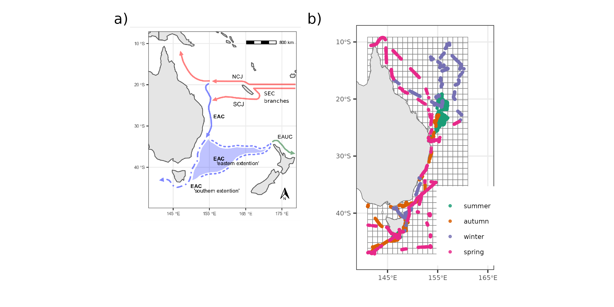
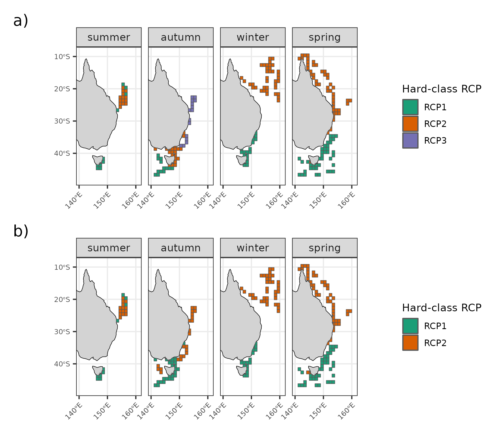
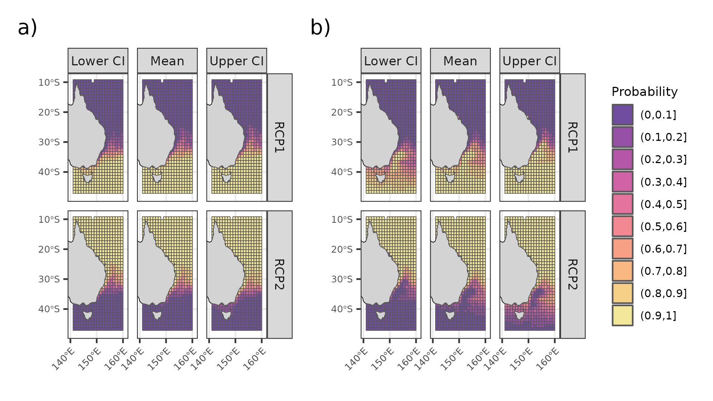

<!-- YAML for bookdown+lua edited following: -->

<!-- https://www.r-bloggers.com/2019/08/rmarkdown-template-that-manages-academic-affiliations-docx-or-pdf-output/ -->

<!-- 'rticles::sim_article' example? -->

<!-- https://github.com/emitanaka/combine2019/tree/master/output/articles/article_template_sim_article -->

```{r setup, include = FALSE, echo = FALSE}
library(gt)
# library(officedown)
# library(officer)
```

\pagebreak

# Introduction

Bioregionalization is the discipline that identifies, delimits, characterises, and names biogeographical regions [@vilhena2015; @morrone2018]. Although there is no agreement on the naming systems between proposed regionalizations [but see @ebach2008], the hierarchical nature of bioregions is well recognized [@vilhena2015; @kreft2010]. Thus, bioregions are usually described within geographically larger classifications, such as 'provinces' or 'realms' [@spalding2007; @costello2017]. The delimitation of bioregions is made through identifying sets of species that are endemic or with high levels of co-occurrence, distinct enough from other regions, which is interpreted as a natural representation of common historical and/or ecological processes shaped by physical and biological forces [@kreft2010]. In particular, the identification of bioregions allows the representation of the distribution of multiple species at a given time and space as well as to relate these regions to environmental characteristics. By doing so, bioregions can be interpreted as species assemblages [@lyons2017; @hill2017]. Given these features, bioregions have a fundamental role in conservation biogeography [@whittaker2005], by being used as management units and even shedding light into conservation gaps [@spalding2007].

Seabird assemblages have been described and related to environmental characteristics worldwide. Considering the hierarchical nature of oceanographic processes and its resulting features (**Haury78**), it is not surprising that the distribution of high mobile seabirds are linked differently across scales [@hunt1987]. In the marine environment, large scale oceanographic features (water masses and currents) act as 'biomes' and influence seabird assemblage structure--i.e. the occurrence of species and its relative numerical composition [@ribic1997; @hyrenbach2007; @commins2014]. On the other hand, at smaller scales, local abundance is related to temporary processes that aggregate prey and therefore predators, such as fronts and eddies [@weimerskirch2007; @scales2014]. Such smaller-scale processes, although ephemeral, are primarily driven by physical and atmospheric forces and are thus somewhat predictable in space and time, providing consistent feeding areas for marine predators when they occur [@davoren2013; @hazen2013]. Noticeably, sea surface temperature is a key driver of distribution of many seabird species, at individual- and assemblage-levels, as well as at large (water masses) and smaller (fronts) scales [@dunlop1988; @ribic1997; @quillfeldt2015]. Nonetheless, many regions still lack information regarding multiple seabird species distribution and how they assemble in space and time.

One such area that could benefit from better understanding of seabird distributions is eastern Australia, considered a world seabird hotspot [@karpouzi2007; @ramírez2017]. Surprisingly, however, there are not many studies on seabird distribution relative to the region's relevance for this group [@mott2018; @bernard2021]. Off northwest Australia, at-sea surveys, multivariate analyses [@dunlop1988] and ensemble species distribution models [@lavers2014] of species assemblages have shown that preferential habitat use of tropical species are related to sea surface temperature and salinity, as well as indicated the importance of the continental shelf for some species. In particular, @dunlop1988 suggests that salinity is the main variable influencing species distribution in oceanic waters whereas temperature would be the key factor on the continental shelf. On the other hand, off eastern Australia, there is a scarcity of studies at larger scales. @reid2000 and @evans2021a analysed seabird assemblages and their relationship with oceanography and prey data, however at coarse scale (tens of km), off southeast Tasmania. At a multi-species, assemblage-level, the latter studies seem to be the only ones on eastern Australia; other studies were mostly descriptive species accounts at local scale [@norman1992distribution; @blaber1994distribution], or focused on a single species [@priddel2014].

The East Australian Current (EAC) is the dominant current in eastern Australia, the major western boundary current in the South Pacific [@ganachaud2014]. The EAC has been extensively studied by physical oceanographers, although its link between oceanography and biological processes is still in its infancy. The dynamic features provided by EAC, such as eddies and upwellings, can likely influence marine biota [@suthers2011; @scales2014]. While most of the biological studies done within this system were focused on plankton entrapment within the cores of eddies [@garcia2022; @firme2023; @hassler2011], there is a growing body of work focusing on fisheries [@hobday2010; @young2011; @brieva2015]. These studies emphasize how the assemblage structure and probability of occurrence of a given taxa is driven by EAC. In particular, the potential biological consequence triggered by climate changes is the tropicalization of the biota, given the EAC is strengthening and getting warmer [@cai2005; @poloczanska2007; @hobday2010; @phillips2022], as shown elsewhere [@hastings2020]. Notwithstanding, the relationship between oceanography and marine megafauna along the EAC is poorly known [@suthers2011], albeit they are considered environmental sentinels [@hazen2019]. Some progress has been made using shark and ray movement data [@jaine2014; @niella2020; @niella2022], and satellite tracking have also demonstrated that increased sea surface temperature in EAC decreases penguin foraging success [@carroll2016]. However, information at the assemblage-level is still scarce [but see @evans2021a].

Given east Australia's importance for seabirds and the recent attention on how climate changes in the EAC can affect marine biota [@poloczanska2007], an assessment of seabird spatial distribution at large scale is timely. Seabirds can serve as sentinels for tracking EAC ecological changes in many facets [e.g. @sydeman2012], including by their distribution. Surprisingly, though, seabird distribution is under-represented in climate change studies, despite being pointed as a priority topic [@grémillet2009; @sydeman2012]. In this study, we aim to identify assemblages of seabird species probabilistically and related them to environmental conditions, by using at-sea surveys data and a state-of-the-art modelling technique. We used the mixture-model Region of Common Profiles [RCP; @foster2013], which is under the best current available tools for describing bioregions [@hill2020; @woolley2020]. RCP is model-based approach, which include a series of advantages over traditional algorithm-based statistics [@warton2015; @hill2020]. East Australia supports a high diversity of seabirds and offers wide environmental gradients, from the tropics to the subantarctics. Therefore, we expect to find different assemblages relating to different environmental conditions. In addition, we provide a repeatable framework on which future studies can build up to assess how EAC changes will influence seabird assemblage distributions.

# Methods

## Study area

The EAC originates from the South Equatorial Current (SEC), a tropical, nutrient-poor water mass. When the SEC's North Caledonian Jet hits the Queensland Plateau (\~18°S), it splits into a north branch running towards the Gulf of Papua and a south branch, which marks the start of the EAC [@kessler2013; @ganachaud2014]. The South Caledonian Jet completes the EAC system at \~22°S after encountering the shelf break in the southern portion of the Great Barrier Reef (**Fig. 1a**; @kessler2013; @ganachaud2014). The EAC interacts with topographical features on the seafloor, from which oceanographic features and processes arise, such as smaller currents, upwellings, and persistent dynamic eddies [@oke2000; @ridgway2003a; @oke2019]. The EAC is mainly attached to the shelf break, but at \~32°S, it spawns an area of eddy generation that dissipates throughout the western Tasman Sea [@mata2006; @oke2019], the 'EAC eastern extension' (@oke2019a; typically mentioned as the 'Tasman Front'). Although most EAC energy is converted into eddies, the EAC still runs southwards following the shelf break towards Tasmania (the 'EAC southern extension'; **Fig. 1a**), possibly carrying eddy-like features as a transient current [@oke2019].

## Seabird and environmental data sources

Seabird data were gathered aboard RV Investigator and RV Falkor during 15 voyages, between 2016--2021, over \~37° of latitude (**Fig. 1b**; **Table S1**). One observer continuously recorded seabirds within a 300-m forward quadrant (eye height **18-m, Eric?** a.s.l) throughout daylight hours while the ship was underway at a constant speed. Species, the number of birds and behaviour were logged directly onto a data entry system through a ship-based web server. Individual records received a date/time/geographic coordinate label (multi-species records have the same label but are logged as separate entries for each species) **(Eric: is there any ref for the protocol?)**.

```{r fig1-study-area, fig.cap = "**FIGURE 1.** Study area showing the main ocean currents (a), and seabird records by season on top of the 1° latitude × 1° longitude grid cells (b). In (a), the East Australian Current (EAC) system is highlighted with its acronyms in bold and drawn in blue color. The EAC system originates from the South Equatorial Current (SEC) and its branches, North Caledonian Jet (NCJ) and South Caledonian Jet (SCJ), drawn in red. The EAC 'eastern extension' is an eddy field (blue shaded area) often mentioned as the 'Tasman Front', from which the East Auckland Current originates (EAUC, in green). Figure (a) is adapted after Oke, Roughan, et al. (2019); for colour references see the online version.", fig.align = "center", echo = FALSE}


```

To explain and predict species distribution and biogeography, a thoughtful choice of covariates is important [@barbet-massin2014]. We used seven oceanographic variables and calculated three climatic layers from them, and three physiographical variables (**Table 1**). These variables are the most used in seabird-environment relationship studies [@tremblay2009], capturing processes at a range of scales from large-scale water-mass properties (e.g. sea surface temperature) to increased predictability of prey availability in mesoscale oceanographic features (e.g. fronts and eddies; @weimerskirch2007; @scales2014). Seabird records were matched with the best open-access, remote-sensed or interpolated data available, and distance from the coast was calculated in R software (see details below).

```{r table1, echo = FALSE}

data.frame(
  Variable = c("Sea Surface Temperature", "Sea Surface Temperature gradient", "Sea Surface Salinity", "Mixed Layer Depth", "8-day average Chlorophyll-a", "Log10 8-day average Chlorophyll-a", "Eddy Kinetic Energy", "Climatic mean EKE", "Climatic standard deviation EKE", "Climatic mean SSTgrad", "Bathymetry", "Slope", "Distance from coast"),
  Abbreviation = c("sst", "sstgrad", "sss", "mld", "chl8", "log10_chl8", "eke", "clim_eke", "clim_ekesd", "clim_sstgrad", "bat", "slope", "dist_coast"),
  Units = c("°Celsius", "delta-°Celsius", "PSU", "m", "mg/m^3", "log10(chl8)", "m/s", "mean(m/s)/season/10 years", "sd(m/s)/season/10 years", "mean(delta-°Celsius)/season/10 years", "m", "degrees", "km"),
  `Spatial resolution` = c("0.25° × 0.25°", "0.25° × 0.25°", "0.083° × 0.083°", "0.083° × 0.083°", "0.036° × 0.036°", "0.036° × 0.036°", "cf", "cf", "cf", "0.25° × 0.25°", "cf", "cf", "NA"),
  `Temporal resolution` = c("daily", "daily", "daily", "daily", "8-days composite", "8-days composite", "daily", "seasonal climatology", "seasonal climatology", "seasonal climatology", "NA", "NA", "NA"),
  Source = c("Huang et al. (2021)", "Derived from Huang et al. (2021)", "E.U. Copernicus Marine Service Information", "E.U. Copernicus Marine Service Information", "ERDDAP/NOAA", "Derived from ERDDAP/NOAA", "IMOS/AODN", "Derived from IMOS/AODN", "Derived from IMOS/AODN", "Derived from Huang et al. (2021)", "GEBCO", "Derived from GEBCO", "Calculated in R (see main text)")
) |>
  gt::gt() |>
  ## SST & SSTgrad
  gt::tab_footnote(footnote = 
                     gt::md("[NOAA OISST](https://psl.noaa.gov/data/gridded/data.noaa.oisst.v2.highres.html)"),
                   locations = gt::cells_body(columns = Source, rows = c(1:2, 10))) |>
  ## SSS & MLD
  gt::tab_footnote(footnote = 
                     gt::md("2011--2019: [GLOBAL_MULTIYEAR_PHY_001_030](https://doi.org/10.48670/moi-00021); 2020--2021: [GLOBAL_ANALYSIS_FORECAST_PHY_001_024](https://doi.org/10.48670/moi-00016)"),
                   locations = gt::cells_body(columns = Source, rows = 3:4)) |>
  ## CHL8 & log10-CHL8
  gt::tab_footnote(footnote = 
                     gt::md("[ERDDAP/NOAA](https://coastwatch.pfeg.noaa.gov/erddap/griddap/erdMH1chla8day.html)"),
                   locations = gt::cells_body(columns = Source, rows = 5:6)) |>
  ## EKE and derivations
  gt::tab_footnote(footnote = 
                     gt::md("[IMOS/AODN](https://portal.aodn.org.au/search), 'OceanCurrent - Gridded sea level anomaly - Delayed mode' data set"),
                   locations = gt::cells_body(columns = Source, rows = 7:9)) |>
  ## GEBCO & slope
  gt::tab_footnote(footnote = 
                     gt::md("[GEBCO](https://www.gebco.net/data_and_products/gridded_bathymetry_data/)"),
                   locations = gt::cells_body(columns = Source, rows = 11:12)) |>
  ## Improve cols names
  gt::cols_label(
    Variable = gt::md("**Variable**"),
    Abbreviation = gt::md("**Abbreviation**"),
    Units = gt::md("**Units**"),
    `Spatial.resolution` = gt::md("**Spatial resolution**"), 
    `Temporal.resolution` = gt::md("**Temporal resolution**"),
    Source = gt::md("**Source**")) |>
  ## Table title
  gt::tab_header(title = gt::md("**TABLE 1.** Environmental data used in the Region of Common Profile models applied to seabird data off eastern Australia, their spatial/temporal resolutions, units, and sources"))

```

## Data treatment

Data wrangling, modelling and visualization were done in R 4.2.0 [@r2022], using packages **X, Y, ..., Z**. Code and (gridded) data are available in **Daudt et al. 2023 (Zenodo repo)**.

Before data extraction, a few environmental layers needed to be calculated. Spatial and temporal persistence of features such as eddy kinetic energy (EKE) and thermal fronts (SSTgrad) may influence seabird movement and distribution by offering a higher likelihood of finding food [@weimerskirch2007; @scales2014a]. Therefore, for EKE and SSTgrad, we calculated climatic, seasonal average layers based on 10-year data (2011--2021), as well as EKE standard deviation (EKEsd) over the same period. EKE was calculated as $0.5 (u'² + v'²)$, where $u' = u - \bar{u}$ and $v' = v - \bar{v}$ are the surface zonal (latitudinal) and meridian (longitudinal) geostrophic currents, respectively, using a rolling mean of 90 days as $\bar{u}$ and $\bar{v}$ (**ROB: Ref here?**). Sea surface temperature gradient (SSTgrad) was calculated as the spatial gradient by identifying the maximum value for each neighbour cell and averaging them (average neighbourhood maximum), from north-to-south (NS) and west-to-east (WE); then, the magnitude of the gradient was defined as $NS² + WE²$ [@burrows2011]. EKE and SSTgrad calculations were done layer-by-layer to match seabird data on the finest scale possible. The slope was calculated using `raster::terrain()`, and distance from the coast was calculated through `sf::st_distance()` using Australia and Tasmania as mainland (ignoring smaller islands). The most proximate value for each seabird record was extracted from each environmental layer using built-in functions from `raster`, `terra`, and `sf` packages.

Seabirds are highly mobile animals, and many species migrate during non-breeding periods [@biology2002]. Therefore, seasonal differences in species composition were expected [e.g. @reid2023], as well as in their probability of occurrence and total numbers. Given that, we aggregated data by 1° latitude $\times$ 1° longitude grid cells (c. 110 $\times$ 110 km) and season (**Fig. 1b**), by summing seabirds from the same species. Birds following the boat were previously excluded from analyses. Considering our aim to test if presence-absence (P/A) and abundance (count) data would result in similar assemblage patterns, we built two species matrices, where the P/A matrix transformed values \>1 to 1. In addition, to avoid spurious correlations with assemblage/environment and numerical instabilities in the models prompted by unusual or rare species, we kept only species occurring in at least six grids within each season (summer = 12; autumn = 21; winter = 20; spring = 33). During data aggregation, the environmental data were averaged. Before modelling, environmental data were scaled and centred.

## Statistical modelling

We used the mixture model Region of Common Profiles (RCP) to identify and describe seabird assemblages. RCP is a one-stage bioregionalization approach, as it identifies bioregions by specifying a statistical model that simultaneously relates biotic (multi-species) and abiotic (environmental) data [@woolley2020; @hill2020]. The model defines 'regions' of similar environmental spaces in which the probability of observing a set of species 'profiles' is constant but different from other regions [@foster2013; @foster2017]. As such, RCPs can be directly interpreted as assemblages, and its species profiles as the assemblage structure. RCP memberships are latent (unobserved) and vary as a function of environmental data, assuming sites within each RCP have constant species profiles. Given a set of environmental variables, the model also enables predicting assemblage probabilities onto sites where no biotic data exist. Additionally, as a feature of model-based approaches, RCPs allow the opportunity to compare models through information criteria, present uncertainty around the results, and check for model assumptions through checking distribution of residuals [@warton2015; @hill2020].

Before fitting models, covariates were checked for collinearity within each season using the modelling dataset. We removed variables $\left|x\right| >0.7$ [@dormann2013], favouring direct measures over the 'climatic' layers we calculated (e.g. if SSTgrad and 'climatic' SSTgrad were correlated, we chose SSTgrad). Thus, 'full models' differed between seasons as the covariates kept vary for each season, although most covariates were common.

Due to seabird migration, seasons could act as 'sampling artifacts' [@foster2017], biasing results [@ponti2023]. Given the difference in species between seasons that met our occurrence threshold, we decided to run RCP models separately by season and data type (P/A, count). RCPs were fitted using the `ecomix` package. All models follow the workflow: (i) finding the best number of groups that describes the data, (ii) re-fit the model by fixing the best number of groups and going through covariates selection, (iii) checking residuals, (iv) bootstrapping the best model to get uncertainty around parameter estimates, and (v) producing results. For steps (i) and (ii), we used Bayesian Information Criterion (BIC) as the metric for model selection, and diagnostics (iii) were assessed visually.

To identify the best number of groups that describe the data, we ran full models (all covariates) with 100 random start numbers [see @foster2013], between 2--7 groups, and chose the number of RCPs that minimized BIC. Then, to assess the best set of environmental covariates, we fixed the number of groups and fitted models for every possible linear, additive combination of covariates specified in the full model. We chose the best model as the one with the lowest BIC. Randomized quantile residual plots modified for mixture models were used to verify model assumptions [@dunstan2013]. To obtain estimates of uncertainty for model parameters (confidence intervals), we used the default settings of `ecomix::regional_mix.bootstrap()`, which applies Bayesian bootstrap 1000 times. A custom code was written to generate partial plots for exploring the influence of covariates on RCP membership.

We built a seasonal 10-year (2011--2021) average layer for predicting model results for each environmental covariate. These variables were then averaged within 1° latitude $\times$ 1° longitude grid cells, by season, between 9--47°S and 141--161°E. Worth noticing that climatic EKEmean and SSTgrad were processed beforehand as they may provide persistent oceanographic features (described above) and thus represent the same value as EKE and SSTgrad. Data for prediction were scaled and centred using the same coefficients from the modelling dataset.

Additionally, to investigate if the amount of information used to run the RCP models was representative, we ran rarefaction curves based on the P/A matrix and the assigned RCP P/A group for each sample (grid). Rarefaction curves were fit using the `iNEXT` package [@chao2014; @hsieh2016], and results are presented based on alpha diversity (i.e. species richness).

<!-- summer \~ bat+slope+eke+sst+sss+mld+sst_grad -->

<!-- autumn \~ bat+slope+eke+chl+sst+sss+mld+sst_grad+clim_sst_grad -->

<!-- winter \~ bat+slope+eke+sst+sss+mld+sst_grad+clim_sst_grad -->

<!-- spring \~ bat+slope+dist_coast+eke+chl+sst+sss+mld+sst_grad+clim_sst_grad+clim_eke_mean -->

# Results

## Summary of species richness and numbers

A total of 10,261 seabird records were obtained. They summed to 142,646 individuals from 80 species, belonging to 11 families and five orders. The five most abundant species summed 83% of total birds counted (43.0% *Ardenna tenuirostris*, 17.2% *Pachyptila turtur*, 14.3% *Ardenna pacifica*, 5.2% *Onychoprion fuscatus*, 3.2% *Thalassarche cauta*), whereas the five most frequent species were *Ardenna pacifica* (frequency of occurrence = 35.3%), *Thalassarche cauta* (33.2%), *Sula leucogaster* (25.4%), *Sula sula* (25.4%) and *Thalassarche melanophris* (25%) (**Fig. S1 - FO/nOCC/FN**). An increase in species richness towards the south was clear in all but the winter season (**Fig S2. - spp richness/total abund**). Noticeably higher counts were made around Tasmania, possibly due to the 'colony effect' (**Fig. S2**). However, one cell in the Coral Sea summed to numbers of the same order of magnitude as off Tasmania in summer.

## RCP models

All models suggested two RCPs as the optimal grouping number, except for P/A-autumn, which indicated three RCPs as the best fit (**Fig S3. - multifit plots**). The best fitting models generally had **1--3** covariates selected, although the abundance-autumn model had five covariates (**Table 2 - full-model/selected model**). All the best models selected SST or SSS, variables essential for characterising water masses. The best models show a good fit with no apparent deviances in assumptions (**Fig. S4 - residuals**).

Grid point-predictions are the assignment of the RCP with the highest probability value for a given cell. When predicting RCP onto space, patterns of point-predictions suggest a biogeographic change around \~34°S, with both P/A and abundance models pointing to similar patterns (**Fig. 2**). These patterns are further reinforced when looking at the mean probability along with the lower and upper confidence intervals of predictions (**Fig. 3**, **Fig. S5**), showing that around \~34°S the 'northern' RCP tends to have higher probabilities in coastal regions, whereas the 'southern' RCP spreads northward offshore. The P/A-autumn model (three RCPs) has a similar broad-scale pattern, although the southern RCP is further south, and a strong 'Tasmania/Bass Straight' assemblage seems to appear (**Fig. 2**, **Fig. S5**).

```{r fig2-point-pred, fig.cap = "**FIGURE 2.** Spatialized point predictions for seabird RCP models, by season, based on presence/absence data (top row) and abundance data (bottom row) off eastern Australia. Each cell was assigned to the RCP group with highest probability (i.e. hard-classes).", fig.align = "center", echo = FALSE}


```

```{r fig3-prob-maps, fig.cap = "**FIGURE 3.** Predicted probabilities of RCP membership in in spring presence/absence (a) and abundance (b) models.", fig.align = "center", echo = FALSE}


```

*Relationship with environmental covariates (highlight SST) --**waiting for 'partial plots' (Fig. 4, Fig. S6)***

The broad pattern of two large-scale assemblages is reflected in their species composition. Although there are overlaps between groups, both P/A and abundance models captured typical tropical species in the northern RCP (e.g. boobies *Sula* spp., lesser frigatebird *Fregata ariel*) and typical Southern Ocean species in the southern RCP (e.g. mollymawks *Thalassarche* spp., fairy prion *Pachyptila turtur*) with higher occurrence/number probabilities in their usual habitat (**Fig. 5**, **Fig. S7**). The P/A-autumn model, which had three RCPs, also showed the characteristic taxa representing the 'northern' and 'southern' RCPs. However, the intermediate 'Tasmania/Bass Straight' assemblage showed a mixture of both groups with shy albatross *Thalassarche cauta* and Australasian gannet *Morus serrator* standing out with high probabilities of occurrence.

# Discussion

This study shows that seabird assemblages off eastern Australia relate to oceanography and how the East Australian Current (EAC) may be playing a key role in structuring seabird distribution at a large scale. Our results are based on a cutting-edge multivariate statistical model [@hill2020], which brings advantages over classical methods for describing species assemblages. For instance, it includes uncertainty around model parameters that allow representing the fuzziness between biogeographical boundaries in a probabilistic framework, which can be monitored given the noticeable anomalies in EAC due to climate change [@phillips2022; @morrone2023biogeographical]. Our results draw an important baseline for seabird assemblages on a world hotspot for this group. **Furthermore, data and code are available to allow reproducibility and future applications to verify spatial and temporal persistence of the described assemblages.**

## Limitations {#limitations}

Although the results suggest consistent patterns, we should point out some caveats of our analyses. Seabird data were gathered opportunistically while taking part on several projects, whose sampling design were not planned to account for seabird spatial ecology specifically. As a result, there are spatial discontinuities on the dataset, which might have limited the ability of our models to detect the relationships between assemblages and environmental predictors more robustly. Even though Australia is a hotspot for seabirds [@karpouzi2007; @ramírez2017], there is not much information regarding seabird distribution to date [@mott2018; @bernard2021]. Dedicated seabird effort could thus benefit future studies advancing seabird research in this region, as well as improving patterns described here. By increasing the amount of data, future studies could set the grid cells at higher resolution, and potentially reveal assemblages at a finer scale. In addition, ideally, we could have had more information within each grid cell by season (our sampling units). Nonetheless, rarefaction curves show that the sample coverage [see @chao2012] was high at the RCP level, although there is room for detecting more species on most of them (**Fig S8 - rarefaction curves**).

## Seabird bioregions off eastern Australia

Spatial patterns clearly showed a 'northern' and a 'southern' assemblage of seabirds off eastern Australia. There is a noticeable link with EAC dynamics, although the weak statistical relationship between RCPs and environmental covariates---RCPs boundaries are closely related with where the EAC turns into its 'eastern extension' and the eddy field spawns [@oke2019]. However, the 'northern/southern' assemblage pattern does not agree with popular, large scale regionalization proposals, such as the pelagic Longhurst Provinces [@longhurst2007], the Marine Ecoregions of the World [MEOW; @spalding2007] province's and ecoregion's, and neither with the Large Marine Ecosystems [LME; @sherman1994]. The MEOW scheme was designed using coastal and shelf biota and it was meant to represent habitats up to the 200-m isobath, which clearly is not representative enough of seabirds' environment. The LME scheme is characterised by physiographical, hydrological and productivity data but has a strong focus on practical management areas and thus a 'political' component on it, which seabirds do not seem to agree with. @longhurst2007 designated only one biogeochemical province for east Australia based on productivity patterns, which may work well at larger scales but seems oversimplified specifically for this region.

The described pattern, on the other hand, agree with the marine biogeographic units proposed by @costello2017, who points out a boundary at \~34°S between their 'Coral Sea' and 'South Australia' realms. The latter regionalization used 65,000 taxa, from benthic/pelagic and coastal/offshore habitats, thus encompassing more complexity of the biogeographic boundaries in the marine environment. Other biological data also suggests 'northern/southern' assemblages off eastern Australia, including tuna and billfish [also highly mobile top predators; @reygondeau2012], mesopelagic fauna [which includes seabird prey; @sutton2017a] and deep-sea invertebrates [@ohara2020] and fish [@ohara2020a]. All these studies focused mainly on describing biological assemblages, whereas the ones mentioned previously focused on the environment. Worth mentioning, the Longhurst' provinces had gone through an update including SST, SSS, bathymetry (the same variables kept by our selected best RCP models) and a temporal component to its equation [@reygondeau2013]. The updated provinces are easily comparable to the seabird assemblages described by us, although still not a perfect match. Australia's bioregionalization has a long story of disagreements [@ebach2012history], however, the inherently link that RCPs develop between environment and biological data can be a strong tool to support marine bioregionalization.

The relationship between seabird assemblages and water masses has been known for a long time [@pocklington1979; @elphick1993; @ribic1997]. Therefore, it is not surprising that at the large scale these two assemblages emerged off eastern Australia. However, the spatial consistency of these patterns throughout seasons is remarkable. Resident species seem to characterise these assemblages. The shy albatross [@hedd2001; @mason2018] and the fairy prions [@fromant2022] in the southern assemblage, and boobies [@bunce2015; @miller2018] and the tropical wedge-tailed shearwater *Ardenna pacifica* [@weimerskirch2020; @mcduie2015] in the northern assemblage, were always profiled with higher probabilities of occurrence and predicted abundances compared to other species. Given that assemblage changes over time are driven by few species [@gotelli2022] and that those species are likely residents [@souza2023], the relationship between resident seabirds and the EAC system should be closely monitored. For instance, coastal seabirds such as the little penguin *Eudyptula minor* are signalling the effects climate change might have in changing seabird behaviour and decreasing foraging success [@carroll2016], which ultimately influence their breeding success and population dynamics [@johnson2021]. Therefore, the species profiles and the spatial predictions of assemblages from RCP models could be used as tools for monitoring seabird responses to the fast-changing EAC.

The seasonal models also captured the influence of migratory species, particularly in the southern assemblage. For instance, summer and autumn models reflected the abundant presence of the short-tailed shearwater *Ardenna tenuirostris* before they depart on their trans-equatorial migration [@carey2014]; the presence of the Australasian gannet was picked up by autumn and winter models [@ismar2011]; and the white-headed petrel *Pterodroma lessonii* movements during chick-rearing and pre-laying exodus [@taylor2021] were detected in autumn and spring models, respectively. Given the geographic location of the southern assemblage, however, we believe subantarctic taxa were not well represented in our models due to their low number of occurrences (**Fig. S1 - FO/nOCC/FN**; hence they were removed before modelling). If increased, dedicated seabird effort is carried out, the data could reflect the seasonal northward pulse of these taxa into the southern assemblage (e.g. albatrosses *Diomedea* spp. and *Phoebetria* spp.), given that more effort translates as higher likelihood of recording these species. In turn, including these taxa onto the models could point towards a more stable 'three assemblage pattern' (as revealed by the P/A-autumn model) in all but summer season, when the majority of Antarctic species are breeding **[Harrison 1983 - is there a better ref here, seabirders?]**, instead of the 'southern/northern' assemblages described here.

## Fitting RCP models to high mobile animals

To the best of our knowledge, this is the first study applying RCPs on high mobile animals such as seabirds. RCP models have been previously applied to plants [@lyons2017], and sessile and **avg?** mobile animals, such as macrobenthic organisms [@pantiukhin2021] and demersal fish [@hill2017]. Differences in species energy and physiological requirements can led animals to using larger areas given their needs and, commonly, pelagic seabirds have daily movements of about hundreds of kilometres per day [e.g. @mcduie2015]. During their movements, seabirds can wander through a variety of habitats and gradients including, for instance, shallow/deep water and poor/productive waters. As such, capturing high mobile species distribution and their relationship with environmental parameters is not a trivial task, and likely harder than for sessile organisms.

While remote tracking studies are advancing our understanding on how seabirds use their environment at fine-, individual-scale level [@tremblay2009], they fail to perceive how groups of species (assemblages) relate to the environment and each other on a shared seascape. Therefore, using at-sea counts of seabirds is a well-established method to capture these relationships [@ainley2012; @woehler2003; @hyrenbach2007]. On the other hand, the spatial scale on which assemblages relate to their environment is also a field of debate [@hunt1987; @ribic1997; @scales2017]. Understanding the biology of the studied group is thus essential to set the appropriate scale of analysis. Our choice of 1° latitude $\times$ 1° longitude was mainly influenced by data availability and the trade-off between number of species per grid/season (see also \@ref(limitations)); nonetheless, the chosen spatial scale is similar with seabird distribution analyses elsewhere [@harris2007; @santora2013; @sojitra2022]. Therefore, for describing seabird assemblages at a large scale, we believe the chosen spatial scale was a good fit, and models described expected patterns of species composition.

RCP models based on presence-absence and abundance (count) data could complement each other. Studies that previously applied RCPs opted by one or another type of data as input. @lyons2017, @hill2017, and @pantiukhin2021 used presence-absence data to run their models, whereas @lee2019good and @receveur2020 used abundance data. Information contained in abundance datasets are inherently better than simplified presence-absence ones. However, the use of different data input in multivariate, biodiversity assessments and assemblage descriptions have shown contrasting patterns at different spatial scales. At larger scales, presence-absence data to equate (relative) abundance in terms of patterns described, while at smaller scales abundance data may highlight local conditions and therefore reveal different patterns, within the broad picture [@marchant1990; @anderson2005; @melo2005; @waters2008marine]. If tied up with biological/ecological knowledge of a particular group, the information contained in both presence-absence and abundance datasets could be leverage to better interpret the resulted patterns. For example, seabirds will likely occur (*presence-absence data*) in specific water masses or currents [@hunt1987; @ribic1997], whereas their abundance (*count/abundance data*) are related to fine scale processes and prey availability [@hunt1987; @weimerskirch2007]. As such, the make-up of assemblages can be described through P/A models and its species probability of occurrence within RCPs at large scales, whereas the relationship with environmental variables at finer scales could improve our understanding on how seabirds relate to their environment and where feeding/aggregation hotspots might be, likely nested within the large scale bioregions.

# Conclusions

We applied a robust, repeatable method to assess seabird assemblages off eastern Australia for the first time. The models point toward a consistent pattern, throughout seasons, of a 'northern' and a 'southern' assemblage, where the spatial division clearly links with the EAC behaviour and SST seems to be the key variable discriminating these groups. As the EAC is predicted to strengthen [@poloczanska2007] as well as extreme weather events such as marine heatwaves to happen more often [@oliver2018], seabirds will likely respond to these changes. Southern ocean albatrosses off southeast Australia, for instance, have shown 'early stages of a southward range shift' due to environmental variability [@sojitra2022]. Resident species such as the little penguins and wedge-tailed shearwater are changing their behaviour and decrease their foraging success when SST is higher [@carroll2016; @peck2004]. Given that eastern Australia is a biodiversity and abundance hotspot for seabirds, it is imperative to set a monitoring program on which the assemblages and species profiles presented here could be used as the baseline for understanding possible effects of a warming ocean on seabird distribution. In particular, the transition zone between assemblages [@morrone2023biogeographical], associated with the EAC eastern extension/eddy-spawning area, may be fundamental to effectively monitoring EAC strengthening and its impact on the marine biota.

# References
