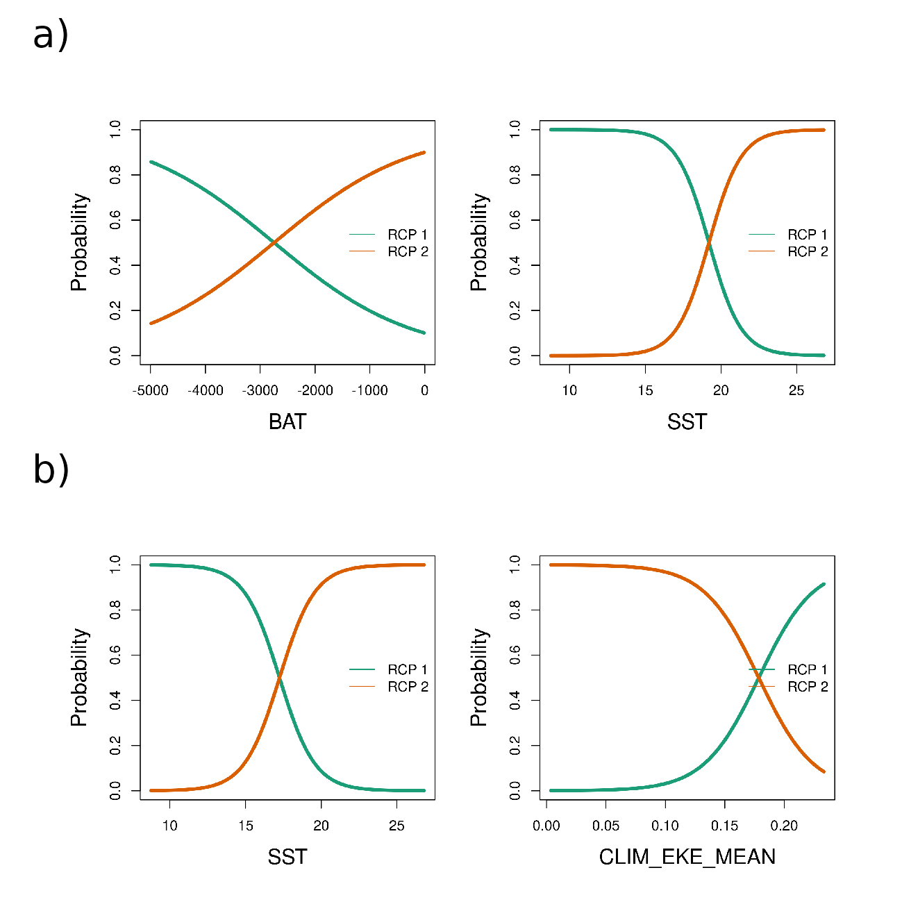

```{r r-pckgs, include = FALSE, echo = FALSE}
library(readr)
library(dplyr)
library(purrr)
library(stringr)
library(kableExtra)
```

# Highlights {.unnumbered}

-   \textcolor{red}{\sout{The East Australian Current (EAC) is experiencing an ongoing poleward intensification}}

-   We described seabird assemblages based on the Region of Common Profiles (RCP) method

-   Assemblages of seabird species were correlated with the \textcolor{red}{East Australian Current}

-   Our analysis can be replicated to assess possible changes in seabird distribution

-   The RCP method works well at the macro spatial scale for highly mobile animals

\newpage

# Introduction

Bioregionalization is the discipline that identifies, delimits, characterises, and names biogeographical regions [@vilhena2015; @morrone2018]. Although there is often no agreement on the naming systems among proposed regionalization schema [but see @ebach2008], the hierarchical nature of bioregions is well recognized [@vilhena2015; @kreft2010]. Thus, bioregions are usually described within geographically larger classifications, such as 'provinces' or 'realms' [@spalding2007; @costello2017]. The delimitation of bioregions is made through identifying sets of species that are endemic or have high levels of co-occurrence, and are distinct enough from other regions. In this sense, bioregions are interpreted as natural representations of common historical and/or ecological processes shaped by physical and biological forces [@kreft2010]. In particular, the identification of bioregions allows representation of the distribution of multiple species at a given time and space, and relating these regions to environmental characteristics. By doing so, bioregions can be interpreted as species assemblages [@lyons2017; @hill2017]. Given these features, bioregions can be used as surrogates for biodiversity monitoring in data-poor regions and in regional conservation planning [@spalding2007; @ferrier2002a], playing a fundamental role in conservation biogeography [@whittaker2005].

Seabird assemblages have been widely described and related to environmental characteristics [@ribic1997; @woehler2003; @hyrenbach2007]. Considering the hierarchical nature of oceanographic processes and their resulting features [@haury1978patterns], it is not surprising that the distribution of highly mobile seabirds are linked differently across temporal and spatial scales [@haury1978patterns; @hunt1987]. In the marine environment, large-scale oceanographic features (e.g. boundary currents and water masses) act similarly to terrestrial biomes (based on vegetation), and influence seabird assemblage structure---i.e. the occurrence of species and their relative numerical composition [@ribic1997; @hyrenbach2007; @commins2014]. In contrast, local abundance is related to meso- (10--100 km) and sub-mesoscale (1--10 km) processes that aggregate prey and therefore predators, such as fronts and eddies [@weimerskirch2007; @scales2014]. Such processes, although relatively ephemeral, are primarily driven by physical and atmospheric forces, and are thus somewhat predictable in space and time, providing consistent feeding areas for marine predators when they occur [@davoren2013; @hazen2013]. Sea surface temperatures are a key driver of seabird distributions, at individual- and assemblage-levels, operating over a range of spatial and temporal scales from macro (e.g. water masses) to fine (e.g. fronts) [@dunlop1988; @ribic1997; @quillfeldt2015; @gall2022; @serratosa2020]. Despite extensive surveys [e.g. @ballance1997] and tracking studies [e.g. @carneiro2020], many oceanic regions still lack information on the distributions and abundances of seabird species, and how they assemble in space and time.

One area in need of better understanding of seabird distributions is Australia, considered a global seabird hotspot [@karpouzi2007; @ramírez2017]. Given the region's importance for seabird diversity, there are surprisingly few studies on seabird distributions at sea [@mott2018; @bernard2021]. Off northwest Australia, at-sea surveys, multivariate analyses [@dunlop1988] and ensemble species distribution models of species assemblages [@lavers2014] showed that habitat use by tropical seabird species was related to sea surface temperatures and salinity. @dunlop1988 suggested that salinity was the main variable influencing species' distributions in oceanic waters while temperature was the key factor for species on the continental shelf. In contrast, there are few studies at large spatial and temporal scales off eastern Australia. @reid2000 and @evans2021a analysed seabird assemblages and their relationships with oceanographic and prey data at mesoscale off southeast Tasmania. The remaining studies are mostly descriptive accounts locally [@norman1992distribution; @blaber1994distribution], or focused on a single species [@priddel2014].

The East Australian Current (EAC) is the major western boundary current in the South Pacific Ocean, and the dominant boundary current off eastern Australia [@ganachaud2014]. The EAC has been extensively studied, although the links between the EAC's oceanography and marine predators are not well known. The dynamic features associated with the EAC, such as mesoscale eddies and upwelling, are likely to influence marine biota [@suthers2011; @scales2014]. While most of the biological studies in this system were focused on plankton entrapment within the cores of eddies [@garcia2022; @firme2023; @hassler2011], there is a growing body of work focusing on fisheries [@hobday2010; @young2011; @brieva2015]. These studies emphasized how the probability of occurrence of a given taxon, and the structure of species assemblages, were driven by the EAC. However, the relationships between oceanography and marine megafauna within the EAC are poorly known [@suthers2011]. Some progress has been made using shark and ray movement data [@jaine2014; @niella2020; @niella2022], and satellite tracking has also demonstrated that increased sea surface temperatures in the EAC decreases little penguin *Eudyptula minor* foraging success [@carroll2016], but information at the assemblage-level for seabirds in the EAC is absent.

Marine species range shifts are more likely to occur faster than terrestrial species due to their higher sensitivity to warming [@pinsky2019; @lenoir2020]. As a result, climate change is rearranging the structure of species assemblages around the globe [@poloczanska2013; @antão2020; @dornelas2014]. Top predators, for instance, may change their core habitats [@hazen2013a; @reisinger2022], with unprecedented population consequences [@woehler2023]. For seabirds, @péron2010 and @sojitra2022 showed that sea surface temperature anomalies affected the occurrence and abundances of albatross and petrel species with latitude, thus affecting assemblage structure. In eastern Australia, changing EAC conditions have affected a range of marine species. For example, changes in zooplankton assemblage structure and fish distribution patterns have been recorded and attributed to warming water temperatures, and shifts in shark distributions are expected [@johnson2011; @niella2022]. A severe marine heatwave driven by a poleward strengthening of the EAC, showed drastic environmental impacts including disease outbreaks in aquaculture farms and wildlife mortalities [@oliver2017]. Given that the EAC is strengthening and extending farther southward and getting warmer [@cai2005; @phillips2022], biological changes are expected to occur [@poloczanska2007; @hobday2010].

In light of eastern Australia's importance for seabirds, and the recent attention on how predicted climate change will influence the EAC's marine biota [@poloczanska2007], an assessment of the contemporary spatial distributions of seabirds within the EAC at large temporal and spatial scales is timely. Seabirds can serve as sentinels for tracking ecological changes in the EAC in many ways [e.g. @sydeman2012]. Surprisingly though, \textcolor{red}{particularly in the Australasian region,} seabird distribution is under-represented in climate change studies, despite being highlighted as a priority topic [@grémillet2009; @sydeman2012].

In this study, we aim to identify assemblages of seabird species within the EAC and adjacent areas, and relate these assemblages to environmental conditions, by using at-sea survey data and a state-of-the-art modelling technique. We use the Region of Common Profiles -- RCP [@foster2013], a mixture model capable of describing bioregions [@hill2020; @woolley2020]. RCP is a model-based approach, and has a range of advantages over traditional algorithm-based statistics [@warton2015; @hill2020]. Eastern Australia supports a high diversity of seabirds and offers wide environmental gradients over a near 40° latitudinal range, from the tropics to the cool temperate. We hypothesised to find different seabird assemblages relating to different environmental conditions within the EAC. In addition, presence-absence and abundance data were used to test if the different numerical resolutions would result in the identification of similar assemblages. This study provides a repeatable framework on which future studies can assess how future changes in the EAC may influence the distribution of seabird assemblages.

# Methods

## Study area

The EAC originates from the South Equatorial Current (SEC), a tropical nutrient-poor current. When the SEC's North Caledonian Jet meets the Queensland Plateau (\~18°S), it splits into a north-flowing branch towards the Gulf of Papua and a south-flowing branch, which marks the start of the EAC [@kessler2013; @ganachaud2014]. The South Caledonian Jet completes the EAC system at \~22°S after encountering the shelf break in the southern portion of the Great Barrier Reef (**Fig.** \@ref(fig:fig-study-area)**a**; @kessler2013; @ganachaud2014). The EAC interacts with the bathymetry of the seafloor, giving rise to oceanographic features and processes, such as smaller currents, upwellings, and persistent dynamic eddies [@oke2000; @ridgway2003a; @oke2019]. The EAC flows polewards and is primarily associated with the shelf break, but at \~32°S it detaches from the shelf and spawns an area of eddy generation that dissipates throughout the western Tasman Sea [@mata2006; @oke2019], the 'EAC eastern extension', often termed the 'Tasman Front' [@oke2019a]. Although most EAC energy is converted into eddies, the EAC still runs southwards following the shelf break towards Tasmania (the 'EAC southern extension'; **Fig.** \@ref(fig:fig-study-area)**a**), carrying eddy-like features as a transient current [@oke2019].

\blandscape

```{r fig-study-area, fig.cap = "\\label{fig-study-area} Study area showing the main ocean currents (a), and seabird records made by season on top of the 1° latitude × 1° longitude grid cells (b). In (a), the East Australian Current (EAC) system is highlighted with its acronyms in bold and drawn in blue. The South Equatorial Current (SEC) and its branches, the North Caledonian Jet (NCJ) and South Caledonian Jet (SCJ), are drawn in red. The EAC 'eastern extension' is an eddy field (blue shaded area) often called the 'Tasman Front', from which the East Auckland Current originates (EAUC, in green). Figure (a) is adapted after Oke, Roughan, et al. (2019); for colour references see the online version", fig.align = "center", out.width = "100%", echo = FALSE}

knitr::include_graphics("../EDA/Fig1-study-area-raw-counts.png")
```

\elandscape

## Seabird and environmental data sources

Seabird data were gathered aboard *RV Investigator* and *RV Falkor* on 15 voyages, between 2016/17--2020/21, spanning over \~37° of latitude (**Fig.** \@ref(fig:fig-study-area)**b**; **Supplementary Table 1**). \textcolor{red}{Two} observers continuously recorded seabirds within a 300 m forward quadrant (eye height 25 m a.s.l) from sunrise to sunset hours while the ship was underway\textcolor{red}{, following a strip-transect protocol}. The species, the numbers of birds, and their behaviours \textcolor{red}{(i.e. flying, feeding, sitting on the water)} were logged in real time into a ship-based web server. \textcolor{red}{Seabird surveys were halted when sea conditions exceeded 6 m wave height and 40 kn of wind or visibility was under 500 m.} Environmental parameters for atmospheric and oceanographic conditions were logged continuously by automated-ship based sensors, with seabird observations supplementing relevant environmental conditions such as visibility or associations with marine mammals. Individual records received a date/time/geographic coordinate label (multi-species records have the same label but are logged as separate entries for each species). Birds following the vessels were excluded from analyses. Seabird observation protocols followed @raymond2010, in use around Australia since 1980.

To investigate and predict species' distributions and relationships with environmental variables, a considered choice of broad-scale climatic and oceanographic covariates is important [@barbet-massin2014]. We used three physiographic variables and seven oceanographic variables, from which a further three climatic layers were calculated (**Table** \@ref(tab:table1)). These variables are the most frequently used in seabird-environment relationship studies [@tremblay2009], capturing processes at a range of spatial and temporal scales from macro-scale water-mass properties to prey availability in meso- to submesoscale oceanographic features [@haury1978patterns; @weimerskirch2007; @scales2014].

\blandscape

```{r table1, echo = FALSE}
data.frame(
  Variable = c("Sea Surface Temperature", "Sea Surface Temperature gradient", "Sea Surface Salinity", "Mixed Layer Depth", "8-day average Chlorophyll-a", "Log10 8-day average Chlorophyll-a", "Eddy Kinetic Energy", "Climatic mean EKE", "Climatic standard deviation EKE", "Climatic mean SSTgrad", "Bathymetry", "Slope", "Distance from coast"),
  # Abbreviation needs the `str_replace_all` because I'm using `escape=F` in `kbl()`
  Abbreviation = stringr::str_replace_all(c("sst", "sst_grad", "sss", "mld", "chl8", "log10_chl8", "eke", "clim_eke_mean", "clim_eke_sd", "clim_sst_grad", "bat", "slope", "dist_coast"), "_", "\\\\_"), 
  Units = c("°Celsius", paste0(parse(text = "\u0394"), "°Celsius"), "PSU", "m", "mg/m${^3}$", "$log_{10}$(chl8)", "m/s", "mean(m/s)/season/11 years", "sd(m/s)/season/11 years", paste0("mean(", paste0(parse(text = "\u0394"), "°Celsius"), ")/season/11 years"), "m", "degrees (°)", "km"),
  `Spatial resolution` = c("0.25° × 0.25°", "0.25° × 0.25°", "0.083° × 0.083°", "0.083° × 0.083°", "0.036° × 0.036°", "0.036° × 0.036°", "0.2° × 0.2°", "0.2° × 0.2°", "0.2° × 0.2°", "0.25° × 0.25°", "0.004° × 0.004°", "0.004° × 0.004°", "NA"),
  `Temporal resolution` = c("daily", "daily", "daily", "daily", "8-days composite", "8-days composite", "daily", "seasonal climatology", "seasonal climatology", "seasonal climatology", "NA", "NA", "NA"),
  Source = c("Huang et al. (2021)${^a}$", "Derived from Huang et al. (2021)${^a}$", "E.U. Copernicus Marine Service Information${^b}{^c}$", "E.U. Copernicus Marine Service Information${^b}{^c}$", "Hu et al. (2012)${^d}$", "Derived from Hu et al. (2012)${^d}$", "IMOS/AODN${^e}$", "Derived from IMOS/AODN${^e}$", "Derived from IMOS/AODN${^e}$", "Derived from Huang et al. (2021)${^a}$", "GEBCO${^f}$", "Derived from GEBCO${^f}$", "Calculated in R (see main text)")
) %>% 
  kableExtra::kbl(caption = "\\label{table1}Environmental data used in the Region of Common Profile models applied to seabird data off eastern Australia, their spatial/temporal resolutions, units, and sources", booktabs = TRUE, escape = FALSE)  %>% 
  kableExtra::row_spec(0, bold = TRUE) %>% 
  kableExtra::column_spec(1, width = "4cm") %>% 
  kableExtra::column_spec(6, width = "3cm") %>% 
  kableExtra::footnote(
    alphabet = c(
    "NOAA OISST: (https://psl.noaa.gov/data/gridded/data.noaa.oisst.v2.highres.html); ", 
    "2011--2019: GLOBAL_MULTIYEAR_PHY_001_030 (https://doi.org/10.48670/moi-00021); ", 
    "2020--2021: GLOBAL_ANALYSIS_FORECAST_PHY_001_024 (https://doi.org/10.48670/moi-00016); ",
    "ERDDAP/NOAA (https://coastwatch.pfeg.noaa.gov/erddap/griddap/erdMH1chla8day.html); ",
    "IMOS/AODN (https://portal.aodn.org.au/search), 'OceanCurrent - Gridded sea level anomaly - Delayed mode' data set; ",
    "GEBCO (https://www.gebco.net/data_and_products/gridded_bathymetry_data/)"))
```

\elandscape

## Data treatment

Data wrangling, modelling and visualization were done in R 4.2.0 [@r2022]; the full list of packages can be found in the Supplementary Material. Code and the modelling dataset (see Section \ref{sec:modellingdatasets}) are available in [@daudt_data_2023].

### Environmental layers

The spatial and temporal persistence of oceanographic features such as eddy kinetic energy ('eke') and thermal fronts (sea surface temperature gradient: 'sst_grad') may influence the movements and distributions of seabirds by offering a higher likelihood of finding food [@weimerskirch2007; @scales2014a]. Thus, 'eke' and 'sst_grad' environmental layers were calculated before extracting environmental data for each seabird record. For both 'eke' and 'sst_grad', we used their original cell spatial resolution (**Table** \@ref(tab:table1)) and calculations were done layer-by-layer to match seabird data on the finest spatial scale possible. Eddy kinetic energy was calculated as $0.5 (u'^{2} + v'^{2})$, where $u' = u - \bar{u}$ and $v' = v - \bar{v}$ are the surface zonal (latitudinal) and meridian (longitudinal) geostrophic currents, respectively, using a rolling mean of 90 days as $\bar{u}$ and $\bar{v}$ [@sun2022]. The spatial 'sst_grad' for each cell was calculated by averaging the maximum value for each neighbouring cell (average neighbourhood maximum), from north-to-south (NS) and west-to-east (WE); then, the magnitude of the gradient was defined as $NS^{2} + WE^{2}$ [@burrows2011]. In addition, we calculated climatic seasonal average layers for 'eke' and 'sst_grad' based on the 11-year data for 2011--2021 as a proxy for persistent oceanographic features, and the 'eke' standard deviation over the same period (named with the prefix 'clim\_' in **Table** \@ref(tab:table1)). Seabed slope was calculated using 'raster::terrain()' [@raster], and distance from the coast was calculated through 'sf::st_distance()' [@sf] using Australia and Tasmania as the mainland (i.e. ignoring smaller islands). Then, for each seabird record, the most proximate value for each environmental layer (original or calculated) was extracted using built-in functions from 'raster' 3.5-21, 'terra' 1.6-7, and 'sf' 1.0-8 packages [@sf; @raster; @terra].

### Data {#modellingdatasets}

\label{sec:modellingdatasets}

Seabirds are highly mobile animals, and many species migrate and/or disperse during their non-breeding periods [@biology2002]. Therefore, seasonal differences in species composition were expected [e.g. @reid2023], and in the probabilities of occurrence and in total numbers. Thus, we built separate modelling datasets for each season. \textcolor{red}{Seasons were defined as summer (Dec--Feb), autumn (Mar--May), winter (Jun--Aug), and spring (Sep--Nov).} We aggregated seabird data by 1° latitude $\times$ 1° longitude grid cells (*c.* 110 $\times$ 110 km) and season (**Fig.** \@ref(fig:fig-study-area)**b**), by summing seabirds from the same species \textcolor{red}{(flying, feeding, and sitting on the water)}. To test if the presence-absence and abundance (raw counts) data would result in similar assemblage patterns, we built two species matrices, where the presence-absence matrix transformed values \>1 to 1. To avoid numerical instabilities in the models prompted by unusual or rare species, we kept only species occurring in at least six grids within each season (summer = 12 species; autumn = 21; winter = 20; spring = 33). The associated environmental data of each seabird record were averaged within the same grid cells and seasons, and environmental data were standardised before modelling.

## Statistical modelling

We used the mixture model Region of Common Profiles (RCP) to identify and describe seabird species assemblages. RCP is a one-stage bioregionalization approach, as it identifies bioregions by specifying a statistical model that simultaneously relates response (multi-species data) and predictor (environmental data) [@woolley2020; @hill2020]. Given a set of environmental variables, the model can predict assemblage probabilities for sites where no biotic (observational) data exist. As a model-based approach, RCPs can be compared by information criteria, present uncertainty around the results, and check for model assumptions through assessing residuals [@warton2015; @hill2020].

The model is specified in terms of assemblages and site-specific probabilities. There are $K$ assemblages (i.e. RCPs), $K = (1, ..., k)$, that are common across the study area. The outcome variable is a vector $y_{i} = (y_{i1}, ... y_{iS})$, that gives the count or presence-absence of each of the $S$ species at site $i$. Depending on whether we model the counts or presence-absence data, the assemblages are defined in terms of the expected frequency or relative frequency of the species, respectively. An output of the model is the estimated probability that site $i$ has each of the $K$ possible assemblages. RCPs are a multivariate adaptation of a mixture-of-experts model; as such, the mixing proportions (assemblage structure) vary according to covariates (predictors) [@foster2013]. RCPs can be directly interpreted as assemblages; the assemblage structure is given by the species profiles \textcolor{red}{(i.e. the proportion of each species within the assemblage given by their probability of occurrence or predicted abundance)}.

Before fitting models, covariates were checked for collinearity within each seasonal dataset. If a pairwise collinearity of $\left|x\right| >0.7$ was found we removed one of the variables [@dormann2013], favouring direct measures over the 'climatic' layers we calculated (e.g. if 'sst_grad' and 'clim_sst_grad' were correlated, we chose 'sst_grad'). Thus, 'full models' differed between seasons as the retained covariates varied, although most covariates were common for all seasons.

Due to seabird migration and dispersion, seasons could act as 'sampling artefacts' [@foster2017], thus biasing results [@ponti2023]. In light of the difference among seasons in the numbers of species that met our occurrence threshold (see Section \ref{sec:modellingdatasets}), we decided to use RCP models by season and data type (presence-absence and abundance). RCP models were used to relate the response variables (i.e. presence-absence or abundance of each seabird species in each grid cell) to the independent predictor covariates (i.e. averaged values of environmental variables in each cell). Presence-absence data were modelled based on a Bernoulli model, whereas abundance data were based on a negative binomial model. RCPs were fitted using the 'ecomix' 1.0.0 package [@ecomix], with the following workflow: (i) find the best number of groups ($K$) that describes the data, (ii) re-fit the model by fixing $K$ and selecting the optimal combination of covariates, (iii) check residuals, (iv) bootstrap the best model to estimate uncertainty of parameter estimates, and (v) produce results.

To identify the best number of RCP groups ($K$) that described the data, we used full models (all covariates) with 100 random start numbers [see @foster2013] between $k = (2, ..., 7)$ groups, and chose the number of RCPs that minimized the Bayesian Information Criterion (BIC). Then, we fixed $K$ at the optimal number and fitted models for every possible linear, additive combination of covariates. We chose the best model as the one with the lowest BIC. Visual inspection of randomized quantile residual plots modified for mixture models was used to verify model assumptions [@dunstan2013]. To obtain estimates of uncertainty for model parameters (confidence intervals), we used the default settings of 'ecomix::regional_mix.bootstrap()', which applies a Bayesian bootstrap 1000 times. A custom code was written to generate partial plots for exploring the influence of covariates on RCP membership.

We built a seasonal 11-year (2011--2021) average layer for predicting model results for each environmental covariate. These variables were then averaged within 1° latitude $\times$ 1° longitude grid cells, by season, between 9--47°S and 141--161°E. Note that 'clim_eke_mean' and 'clim_sst_grad' were processed beforehand as they may characterise persistent oceanographic features (described above) and thus represent the same value as 'eke' and 'sst_grad'. Data for prediction were standardised using the same mean and standard deviation from the modelling dataset.

Finally, we ran rarefaction curves based on the presence-absence matrix and the assigned RCP group for each sample (grid cell) to assess if the amount of information in the RCP model was representative. Rarefaction curves were fit using the 'iNEXT' 3.0.0 package [@chao2014; @hsieh2016], and results are presented based on alpha diversity (i.e. species richness).

# Results

## Summary of species richness and numbers

A total of 10,261 seabird records was obtained during the 15 voyages, comprising 142,646 individuals from 80 species, belonging to 11 families and five orders. The five most abundant species made up 83% of total birds counted (43.0% short-tailed shearwater *Ardenna tenuirostris*, 17.2% fairy prion *Pachyptila turtur*, 14.3% wedge-tailed shearwater *Ardenna pacifica*, 5.2% sooty tern *Onychoprion fuscatus*, 3.2% shy albatross *Thalassarche cauta*). The five most frequently encountered species were *A. pacifica* (frequency of occurrence = 35.3%), *T. cauta* (33.2%), brown booby *Sula leucogaster* (25.4%), red-footed booby *S. sula* (25.4%) and black-browed albatross *T. melanophris* (25%) (**Supplementary Fig. 1**). An increase in species richness towards the south of the study region was clear in all but the winter season (**Fig.** \@ref(fig:fig-spprich-nbirds)). Noticeably higher counts were made around Tasmania, possibly due to the 'colony effect' and/or the presence of Southern Ocean species (**Fig.** \@ref(fig:fig-spprich-nbirds)). However, in summer, one cell in the Coral Sea had counts of the same order of magnitude as off Tasmania.

```{r fig-spprich-nbirds, fig.cap = "\\label{fig-spprich-nbirds}Species richness and the total number of seabirds counted off eastern Australia during Australasian Seabird Group's ship-based surveys between 2016--2021, by grid/season, after data aggregation (see Methods). Dots represent the grid centroids.", fig.align = "center", out.width = "100%", echo = FALSE}


```

## RCP models

\textcolor{red}{In this section, we will present only the main results for the spring season when delving into specifics about each model and its results. The results of spring models summarise the key findings of our analysis, but we encourage the reader to look at the Supplementary Material for other seasons.}

For all models, two RCPs was the optimal number of seabird groups, except for the presence-absence-autumn model, which indicated three RCPs as the best fit (**Supplementary Figs. 2, 3**). The best fitting models generally had one or two covariates selected, although the abundance-autumn model had five covariates (**Table** \@ref(tab:table2)). The best models showed a good fit with no apparent deviations from the assumptions (**Supplementary Figs. 4, 5**). All the best models selected sea surface temperature ('sst') or salinity ('sss'), as essential for characterising water masses. The thresholds for defining RCP membership were 18--21°C for 'sst' and 35.1 PSU for 'sss' (**Fig.** \@ref(fig:fig-partial-plots), **Supplementary Figs. 6, 7**), similar to the characteristics used to to define the EAC. Furthermore, most of the best models selected bathymetry ('bat'), suggesting a gradient between 'coastal' and 'oceanic' taxa (**Supplementary Figs. 6, 7**). Of particular note, proxies for persistent oceanographic features that may aggregate food resources (the 'climatic' variables) for seabirds were selected only in the autumn and spring abundance models.

```{r table2, echo = FALSE, message = FALSE}
df <- 
  rbind(
    list.files(path = "../results/Bernoulli", pattern = "*04_full_and_best_models.csv", full.names = TRUE),
    list.files(path = "../results/NegBin", pattern = "*04_full_and_best_models.csv", full.names = TRUE)) %>% 
  purrr::map_df(~readr::read_csv(.)) %>% 
  dplyr::select(- `...1`) %>% 
  dplyr::mutate(data_type = factor(data_type, 
                                   levels = c("bernoulli", "neg_bin"),
                                   labels = c("Bernoulli", "Negative Binomial")),
                season = factor(season, 
                                levels = c("summer", "autumn", "winter", "spring"),
                                labels = c("Summer", "Autumn", "Winter", "Spring")),
                model = factor((ifelse(model == "full", "a", "b")), levels = c("a", "b")),
                bic = round(bic, digits = 2)) %>%
  dplyr::group_by(data_type) %>% 
  dplyr::arrange(data_type, season) %>% 
  as.data.frame(.) %>% 
  dplyr::ungroup(.)

# Correct a value in a cell
# Full abundance-autumn model did not fit properly, returning a value of -Inf
df[df$data_type=='Negative Binomial' & df$season=='Autumn' & df$model=='a',]$bic <- "-Inf (n.f.)"

# A few adjustments for nicer output
# df$model_specification <- stringr::str_replace_all(df$model_specification, " ", "")
colnames(df)[3] <- 'Model'
colnames(df)[4] <- 'Model specification'
colnames(df)[5] <- 'BIC'

kableExtra::kbl(df, caption = "\\label{table2}Full (a) and best (b) Region of Common Profile Models applied to seabird data off eastern Australia, for both data types used (presence-absence, based on Bernoulli models; abundance, based on negative binomial models). Refer to Table 1 for the environmental data acronyms", booktabs = TRUE) %>% 
  kableExtra::column_spec(0, bold = TRUE) %>%
  kableExtra::column_spec(1, bold = TRUE) %>%
  kableExtra::column_spec(4, width = "11cm") %>% 
  kableExtra::collapse_rows(columns = c(1:3),
                            latex_hline = 'custom',
                            custom_latex_hline = 1:3,
                            row_group_label_position = 'stack')

rm("df")
```

```{r fig-partial-plots, fig.cap = "\\label{fig-partial-plots}Partial plots for the retained covariates in the best spring (a) presence-absence and (b) abundance models. The plot shows the fitted probability of belonging to a Region of Common Profiles (RCP) against the environmental value. All other predictors are held at their mean values. Results for other seasons and models can be found in the \\textbf{Supplementary Figs. 6, 7}. Refer to Table 1 for the environmental data acronyms", fig.align = "center", out.width = "100%", echo = FALSE}


```

Grid point-predictions are the assignment of the RCP with the highest probability value for a given cell. When predicting RCP onto space, patterns of point-predictions suggest a biogeographic transition in seabird species around \~34°S, with both presence-absence and abundance models pointing to similar results (**Fig.** \@ref(fig:fig-point-pred)). These patterns are further reinforced when looking at the mean probability along with the lower and upper confidence intervals of predictions (**Fig.** \@ref(fig:fig-prob-maps), **Supplementary Figs. 8, 9**), showing that around \~34°S, the 'northern' RCP tended to have higher probabilities in coastal regions, whereas the 'southern' RCP spread northward offshore. The autumn presence-absence model (three RCPs) had a similar broad-scale pattern, although the southern RCP is farther south, and a strong 'Tasmania/Bass Strait' assemblage appears (**Fig.** \@ref(fig:fig-point-pred), **Supplementary Figs. 8, 9**).

```{r fig-point-pred, fig.cap = "\\label{fig-point-pred}Spatialized point predictions (hard-classes) for seabird assemblages (Region of Common Profile; RCP), by season, based on presence-absence (a) and abundance (b) models, off eastern Australia. Each grid was assigned to the RCP group with highest membership probability", fig.align = "center", out.width = "110%", echo = FALSE}


```

\newpage

\blandscape

```{r fig-prob-maps, fig.cap = "\\label{fig-prob-maps}Predicted probability membership of each seabird assemblage (Region of Common Profiles; RCP) and grid, off eastern Australia, from spring presence-absence (a) and abundance (b) models. The central column, 'mean', corresponds to the point prediction and Bayesian boot-strapped, lower and upper confidence intervals (CI), on its sides. Note that, in case of two RCPs, RCP2 probability equals (1 - RCP1 probability). Results for other seasons and models can be found in the \\textbf{Supplementary Figs. 8, 9}", fig.align = "center", out.width = "110%", echo = FALSE}


```

\elandscape

\newpage

The broad pattern of two large-scale assemblages is reflected in their species compositions. Although there are overlaps among the seabird groups, both presence-absence and abundance models captured typical tropical species in the northern RCP (e.g. boobies *Sula* spp., lesser frigatebird *Fregata ariel*) and typical Southern Ocean species in the southern RCP (e.g. small albatrosses *Thalassarche* spp., fairy prion *P. turtur*) (**Fig.** \@ref(fig:fig-spp-profiles), **Supplementary Figs. 10, 11**). The autumn presence-absence model, which had three RCPs, also showed the characteristic taxa representing the 'northern' and 'southern' RCPs. However, the intermediate 'Tasmania/Bass Strait' assemblage showed a mixture of both groups with shy albatross and Australasian gannet *Morus serrator* prominent with high probabilities of occurrence.

\blandscape

```{r fig-spp-profiles, fig.cap = "\\label{fig-spp-profiles}Species profiles of seabird assemblages (Region of Common Profile; RCP) off eastern Australia in spring. Values are the average and 95\\% confidence intervals of probability of occurrence (a) and predicted mean abundance (b) for each species, based on 1000 Bayesian bootstraps. Values in (b) were log10-transformed to accommodate the high variation between species. Results for other seasons and models can be found in the \\textbf{Supplementary Figs. 10, 11}. Note the species on the Y-axis are ordered alphabetically, from bottom up.", fig.align = "center", out.width = "80%", echo = FALSE}


```

\elandscape

\newpage

# Discussion

This study showed that seabird assemblages off eastern Australia were correlated with oceanographic conditions, and that the East Australian Current appeared to be key in structuring seabird distributions at meso- to macro scales [*sensu* @hunt1987]. Our results are based on a multivariate statistical model [@hill2020], which brings advantages over classical methods for describing species assemblages. RCP models allow estimating uncertainty around the point probability of a sample (grid cell) belonging to an assemblage, thus representing the fuzziness between bioregion boundaries. These transition zones between bioregions are essential for monitoring biological changes due to environmental changes [@morrone2023biogeographical]. As such, the boundary between the two consistently identified bioregions in this study may be a crucial region to monitor in future, given noticeable anomalies in the EAC at this same region [@phillips2022]. Our results draw an important baseline for seabird assemblages in a world hotspot for seabirds.

## Seabird bioregions off eastern Australia

The relationships between seabird assemblages and water masses has been \textcolor{red}{well established} [@pocklington1979; @elphick1993; @ribic1997; @gall2022]. Thus, it is not surprising that two seabird assemblages were identified off eastern Australia. However, the spatial consistency of these patterns throughout seasons is surprising and remarkable \textcolor{red}{(but see Section \ref{sec:limitations})}. Resident species seem to characterise these assemblages. Shy albatross [@hedd2001; @mason2018] and fairy prions [@fromant2022] in the southern assemblage, and boobies [@bunce2015; @miller2018] and wedge-tailed shearwaters [@weimerskirch2020; @mcduie2015] in the northern assemblage, were always profiled with higher probabilities of occurrence and predicted abundances compared to other species in the same groups. Given that changes in assemblages over time are typically driven by a few species [@gotelli2022], and that those species are likely residents [@souza2023], the relationships between these resident seabirds and the EAC system over the broad latitudinal range detailed here should be closely monitored. Elsewhere, coastal seabirds such as little penguin are signalling the adverse effects that climate change might have in changing seabird behaviours and decreasing foraging success [@carroll2016; @woehler2023], which ultimately influence their breeding success and population dynamics [@johnson2021]. Thus, the species profiles and the spatial predictions of assemblages from RCP models could be used as tools for monitoring future seabird responses to the fast-changing EAC.

The seasonal models also captured the influence of migratory species, particularly in the southern assemblage. The summer and autumn models reflected the high abundance of short-tailed shearwater before they depart on their trans-equatorial migration [@carey2014]; the presence of the Australasian gannet was picked up by the autumn and winter models [@ismar2011]; and the white-headed petrel *Pterodroma lessonii* movements during chick-rearing and pre-laying exodus [@taylor2021] were detected in autumn and spring models, respectively. Given the geographic location of the southern assemblage, however, we believe sub-Antarctic taxa were not well represented in our models due to their low number of occurrences and relative paucity of survey effort to date (**Supplementary Fig. 1**; hence they were removed before modelling). Additional surveys may reveal the seasonal northward pulse of these taxa into the southern assemblage (e.g. albatrosses *Diomedea* spp. and *Phoebetria* spp.), given that more effort translates as higher likelihood of recording these species. In turn, including these taxa in the models could result in a more stable 'three assemblage pattern' (as revealed by the autumn presence-absence model) in all but the summer season, when the majority of Antarctic species are breeding [@marchant1990handbook].

Our analyses clearly revealed a 'northern' and a 'southern' assemblage of seabirds off eastern Australia within the EAC. There is a noticeable link with the EAC dynamics: the boundaries of RCPs occurred at \~34°S, near the average separation latitude (\~32°S; 25--38°S) of the EAC and its eastward extension into the Tasman Sea [@oke2019]. However, the 'northern/southern' assemblage pattern identified herein does not agree with previously-proposed large-scale regionalizations, such as the pelagic Longhurst Provinces [@longhurst2007], the Marine Ecoregions of the World [MEOW; @spalding2007], or the Large Marine Ecosystems [LME; @sherman1994]. The MEOW schema was based on coastal and shelf biota and was meant to represent habitats to the 200 m isobath, which clearly does not encompass the entirety of seabird habitats. The LME schema is characterised by physiographical, hydrological and productivity data but has a strong focus on practical management of areas and thus there is a political component embedded within it, which does not align with seabird distributions. @longhurst2007 designated only one biogeochemical province for eastern Australia based on productivity patterns, which may work well at larger (macro) scales, but appears to be oversimplified for the EAC.

The results do agree with the marine biogeographic units proposed by @costello2017, who identified a boundary at \~34°S between their 'Coral Sea' and 'South Australia' realms. Their approach used 65,000 taxa, from benthic/pelagic and coastal/offshore habitats, thus integrating more complexity of the biogeographic boundaries in the marine environment. Other biological data also suggest 'northern/southern' assemblages off eastern Australia, including tuna and billfish [also highly mobile top predators; @reygondeau2012], mesopelagic fauna [which includes seabird prey; @sutton2017a] and deep-sea invertebrates and fish [@ohara2020; @ohara2020a]. All these studies focused mainly on describing biological assemblages, as opposed to classifying environments. It is worth noting that the Longhurst Provinces approach was updated to include SST, SSS and bathymetry (the same variables retained by our best RCP models) and a temporal component to the classification [@reygondeau2013]. The updated provinces are more similar to the seabird assemblages described here, although still not a perfect match, which could be partially explained because the seabird assemblage in the EAC region includes several long-distance migratory species. Australia's bioregionalization has a long story of disagreements [@ebach2012history], however, the inherent link that RCPs develop between environment and biological data can be a strong tool to support marine bioregionalization.

## Fitting RCP models to highly mobile animals

To the best of our knowledge, this is the first study applying RCPs to highly mobile animals such as seabirds. RCP models have been previously applied to plants [@lyons2017], and relatively sedentary animals, such as macrobenthic organisms [@pantiukhin2021] and demersal fish [@hill2017]. Oceanic seabirds can have daily movements of hundreds of kilometres [e.g. @mcduie2015], during which they traverse a variety of habitats and environmental gradients. As such, capturing the distribution of highly mobile species, and their relationships with environmental parameters is not a trivial task, and much harder than for sessile organisms. \textcolor{red}{Among marine megafauna, seabirds are relatively easy to detect visually, enabling suitable sample sizes to be gathered over large areas} [@ballance2007]\textcolor{red}{. Thus, seabirds can be used as models to study the distribution of highly mobile animals in relation to environmental characteristics in the marine environment.}

While remote tracking studies are advancing our understanding on how individual seabirds use their environment at fine scales [@tremblay2009; @trevail2023], they fail to perceive how species assemblages interact with the environment and each other. Therefore, using at-sea counts of seabirds is a well established method to capture these relationships [@ainley2012; @woehler2003; @hyrenbach2007]. Further, the spatial scales on which assemblages relate to their environment is variable and species-specific [@hunt1987; @ribic1997; @scales2017]. Understanding the biology of the studied group is thus essential to set the appropriate scales of analyses. Our choice of 1° latitude $\times$ 1° longitude was mainly determined by data availability reflecting survey effort, and the trade-off between the number of species per grid/season (see also Section \ref{sec:limitations}). Nonetheless, the chosen spatial scale is similar to other seabird distribution analyses conducted elsewhere [@harris2007; @santora2013; @sojitra2022]. Therefore, for describing seabird assemblages at a macro-scale, the chosen resolution seems to have been a good fit, accords with studies elsewhere, and the resultant models described patterns of seabird species' composition consistent with our current understanding of species' ecologies and life history strategies.

RCP models based on presence-absence and abundance data are able to complement each other. Previous studies using RCPs have opted to use only one type of response data. @lyons2017, @hill2017, and @pantiukhin2021 all used presence-absence data, whereas @lee2019good and @receveur2020 used abundance (count) data. The added information contained in abundance data make them inherently more powerful than binary presence-absence data. However, the use of different data inputs in multivariate biodiversity assessments and assemblage descriptions has shown contrasting patterns at different spatial scales. At larger spatial and temporal scales, presence-absence data describe similar patterns to abundance data [@anderson2005], as we found. In contrast, at smaller scales, abundance data may highlight local conditions and therefore reveal hidden patterns at coarse to fine scales [@marchant1990; @anderson2005; @melo2005; @waters2008marine]. If combined with ecological knowledge of a particular group, the information contained in both presence-absence and abundance data could be leveraged to better interpret the resulting patterns.

For example, seabirds will likely occur in specific water masses or currents [@hunt1987; @ribic1997; @commins2014; @gall2022], whereas their abundance is related to coarse- to fine-scale processes that enhance prey availability [@hunt1987; @weimerskirch2007; @depascalis2021]. \textcolor{red}{Although we have not approached the data in a multi-scale analysis, our results partially support this. Presence-absence models retained static variables and oceanographic variables that define water masses (i.e. SST and salinity). In addition to those, the autumn and spring abundance models also retained variables associated with persistent oceanographic features (e.g. climatic variables related to eddies and fronts), as well as mixed layer depth and chlorophyll in the autumn model. Eddies, fronts, high chlorophyll and shallower mixed layer depths are all related to increased seabird foraging success} [@weimerskirch2007; @scales2014; @depascalis2021]\textcolor{red}{, and therefore likely to influence seabird numbers. Thus,} future studies assessing bioregions of highly mobile animals could describe the compositions of assemblages using smaller resolution grid cells and presence-absence models. Then, abundance models using higher resolution grid cells could improve our understanding of how these animals relate to their environment and possibly reveal multi-species aggregation areas (therefore 'new bioregions') likely nested within the bioregions described at large scales. Such a hierarchical approach would require substantial concurrent observational and environmental data sets, which\textcolor{red}{, to our knowledge, do not exist for our study area}.

## Limitations

\label{sec:limitations}

Although the results suggest consistent patterns, there are a number of caveats to our analyses. Seabird data were gathered during multi-disciplinary cruises, whose sampling designs were not specifically planned to account for spatial ecology of seabirds. As a result, there are spatial discontinuities in the data, which might have limited the ability of our models to detect the relationships between the seabird assemblages and the full spectrum of environmental predictors. Even though Australia is a hotspot for seabirds [@karpouzi2007; @ramírez2017], there is a paucity of information on seabird distributions in the region [@mott2018; @bernard2021]. Dedicated seabird surveys would help to advance seabird research in this region, and improve our understanding of the patterns described here. By increasing the amount of data, future studies could set the grid cells at higher resolution, and potentially reveal assemblages at finer spatial and temporal scales. In addition, ideally, we would have had more information within each grid cell by season (our sampling units). Nonetheless, rarefaction curves show that the sample coverage [see @chao2012] was high at the RCP level, although there is room for detecting more species in most of them (**Supplementary Fig. 12**).

\textcolor{red}{These limitations are illustrated in the results for the summer and autumn seasons. Considering the strong support for a southern and a northern assemblage, we note that both summer and autumn lack samples in representative southern and northern (summer) and northern (autumn) areas. Albeit the sample coverage values were overall high, compared to winter and spring, summer and autumn had lower values (in particular, for the southern assemblage 'RCP1' in summer and for the northern assemblage 'RCP3' in autumn; \textbf{Supplementary Fig. 12}). Further, based on point predictions, higher probabilities of the southern assemblage in the northern area in summer (both presence-absence and abundance models) and of the northern assemblage in the southern area in autumn (abundance model), were assigned to a few grids (\textbf{Fig.} 4). The latter reinforces the possible weakness of these models to detect stronger relationships between the identified assemblages and the predictors. We also acknowledge the sharp spatial change in probabilities between assemblages in summer models (i.e. without a proper 'transition zone'), which may be related to the previous point. However, both summer and autumn models detected higher probabilities of expected taxa in their species profiles, suggesting that the make-up of the assemblage was well distinguished by the models. In addition, these models also seem to have captured the appropriate number of assemblages, agreeing with other models/seasons. Despite their limitations, we believe these models agree with the big picture of our results, therefore being a valid resource as a baseline.}

# Conclusions

We applied a robust, repeatable method to assess seabird assemblages off eastern Australia within the EAC for the first time. The models point toward a consistent pattern of a 'northern' and a 'southern' seabird assemblage, where the spatial division is attributable to the eastward separation of the EAC from the coast, and that SST seems to be the key variable discriminating these groups. \textcolor{red}{The mechanistic links between SST and seabird assemblages deserve more studies but may be due to the distribution of seabird prey, which at the biogeographic level seems to correlate with our findings} [@sutton2017a]. The EAC has penetrated poleward over the past half-century [@li2022; @hill2008], a trend which is anticipated to continue into the future [@yang2016], and extreme weather events such as marine heatwaves to happen more often [@oliver2018]. As such, seabirds will have to respond to these changes [@woehler2023]. Southern Ocean albatrosses off southeast Australia, for instance, have shown 'early stages of a southward range shift' due to environmental variability [@sojitra2022]. Resident species such as little penguins and wedge-tailed shearwater change their behaviour and have decreased foraging success when SST is higher [@carroll2016; @peck2004]. Given that eastern Australia is a biodiversity and numerical hotspot for seabirds, it is imperative to establish a monitoring program allowing the assemblages and species profiles presented here to be used as the baseline for understanding possible effects of a warming ocean on seabird distribution. \textcolor{red}{In particular, the transition zone between assemblages might be pushed southwards along with the expected trend of the EAC. The transition zone between assemblages} [@morrone2023biogeographical], associated with the eastern extension of the EAC, may be fundamental to effectively monitoring the strengthening of the EAC and the subsequent impact on marine biota.

# Acknowledgements {.unnumbered}

We thank all observers who assisted in data collection, the crews of RV *Investigator* and RV *Falkor*, and the Australasian Seabird Group (BirdLife Australia) for logistical support. The authors would like to thank Dr. Skipton N.C. Woolley, `{ecomix}` developer, who kindly helped NWD build preliminary models and gave advice in several stages of model construction. \textcolor{red}{NWD thanks the Department of Marine Science (University of Otago) for supporting a PhD writing retreat, during which most of this manuscript was drafted. Thanks also to two anonymous reviewers whose comments helped improve our manuscript.} NWD is supported by a Doctoral scholarship from the University of Otago; LB is a research fellow from CNPq (310145/2022-8).

# References {.unnumbered}

::: {#refs}
:::

\newpage

# Authors' contribution (CRediT) {.unnumbered}

**Nicholas W. Daudt:** Conceptualization; Methodology; Software; Formal analysis; Data Curation; Visualization; Writing - Original Draft. **Eric J. Woehler:** Conceptualization; Methodology; Investigation; Resources; Data Curation; Writing - Review & Editing; Supervision. **Matthew R. Schofield:** Conceptualization; Software; Writing - Review & Editing; Supervision. **Robert O. Smith:** Writing - Review & Editing; Supervision. **Leandro Bugoni:** Writing - Review & Editing; Supervision. **William J. Rayment:** Conceptualization; Writing - Review & Editing; Supervision.

# ORCID {.unnumbered}

Nicholas W. Daudt <https://orcid.org/0000-0001-8211-8771>

Eric J. Woehler <https://orcid.org/0000-0002-1125-0748>

Matthew R. Schofield <https://orcid.org/0000-0003-1481-2766>

Robert O. Smith <https://orcid.org/0000-0001-5931-3843>

Leandro Bugoni <https://orcid.org/0000-0003-0689-7026>

William J. Rayment <https://orcid.org/0000-0001-9558-5109>

\newpage

# Data Accessibility Statement {.unnumbered}

The data that support the findings of this study are openly available in Daudt *et al.* (2023), from Open Science Framework (OSF) at <https://doi.org/10.17605/OSF.IO/N582D>. The seabird raw data are currently being used for other projects and thus can not be publicly available---if you are interested in it, please contact Eric J. Woehler. The environmental data used in this study are freely available in their source: (i) GEBCO Compilation Group provided detailed bathymetric data (<doi:10.5285/a29c5465-b138-234d-e053-6c86abc040b9>); (ii) Eddy kinetic energy was derived from data sourced from Australia's Integrated Marine Observing System (IMOS), enabled by the National Collaborative Research Infrastructure Strategy (NCRIS); (iii) Sea surface salinity and mixed layer depth were sourced from E.U. Copernicus Marine Service Information; (iv) Sea surface temperature was sourced from NOAA OI SST V2 High Resolution Dataset provided by the NOAA PSL, Boulder, Colorado, USA; and (v) Chlorophyll-*a* was sourced from ERDDAP/NOAA, which uses NASA's Aqua-MODIS satellite data. See detailed information regarding environmental layers in the main text (Table 1).

# Funding {.unnumbered}

Parks Australia provided funding support to participants for selected voyages.

# Conflict of interest disclosure {.unnumbered}

The authors declare that they have no known competing financial interests or personal relationships that could have appeared to influence the work reported in this paper.
