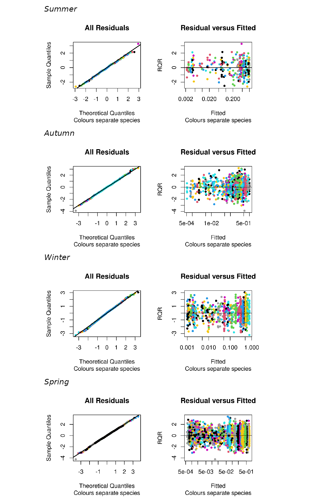
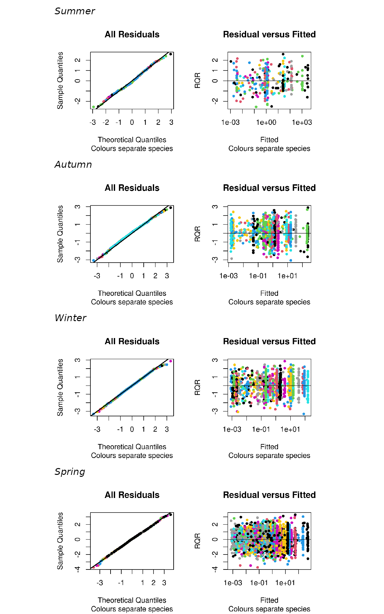
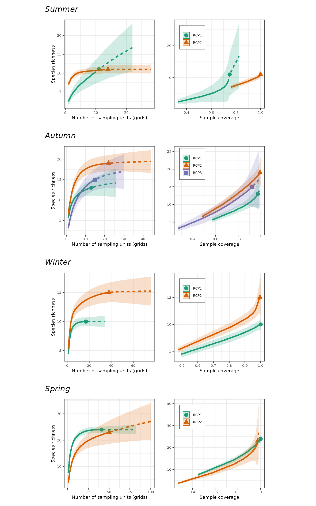

```{r setup, include = FALSE, echo = FALSE}
library(readr)
library(dplyr)
library(purrr)
library(stringr)
library(gt)
```

This document is a supplementary file for @daudt2024. Briefly, here you will find:

-   **List of packages** (and version) used for data wrangling, visualisation and analyses, and their full references;
-   **Table 1**: Summary of sampling effort by voyage;
-   **Fig. 1**: Number of occurrences, frequency of occurrence (FO), and numeric frequency (NF) for each recorded species by season;
-   **Figs. 2, 3**: Plots for choosing best RCP group number (`multifit`);
-   **Figs. 4, 5**: Residual plots from the best fitted models;
-   **Figs. 6, 7**: Partial plots for covariates;
-   **Figs. 8, 9**: Probability maps from seasonal predictions;
-   **Figs. 10, 11**: Species profiles for each season;
-   **Fig. 12**: Species-richness and sample-coverage curves.

\newpage

# List of packages

We used the following packages 'plyr' 1.8.8 [@plyr], 'dplyr' 1.1.2 [@dplyr], 'tidyr' 1.3.0 [@tidyr], 'readr' 2.1.4 [@readr], 'tibble' 3.2.1 [@tibble], 'lubridate' 1.9.2 [@lubridate], 'stringr' 1.5.0 [@stringr], 'purrr' 1.0.1 [@purrr], 'ggplot2' 3.4.2 [@ggplot2], 'ggspatial' 1.1.7 [@ggspatial], 'patchwork' 1.1.2 [@patchwork], 'RColorBrewer' 1.1-3 [@rcolorbrewer], 'rnaturalearth' 0.3.2 [@rnaturalearth], 'sp' 1.6-0 [@sp1; @sp2], 'sf' 1.0-8 [@sf], 'mapview' 2.11.0 [@mapview], 'raster' 3.5-21 [@raster], 'terra' 1.6-7 [@terra], 'rerddap' 1.0.2 [@rerddap], 'rerddapXtracto' 1.1.4 [@rerddapXtracto], 'hadsstR' [@hadsstr], 'corrplot' 0.92 [@corrplot2021], and the ones referenced in the main text.

The code is archived in an Open Science Framework repository in [@daudt_data_2023], where you can find a detailed walk-through.

# References {.unnumbered}

::: {#refs}
:::

\newpage

\blandscape

```{r table-S1, echo = FALSE}
read.csv("../results/tableS1-effort-summary.csv")  %>% 
  dplyr::select(-X) %>% 
  gt::gt() %>% 
  # Tidy-up column labels
  gt::cols_label(
    voyage = gt::md("**Voyage**"),
    date_start = gt::md("**Date start**"),
    date_end = gt::md("**Date end**"),
    lat_range = gt::md("**Latitudinal range**"), 
    lon_range = gt::md("**Longitudinal range**"),
    no_records = gt::md("**No. of records**"),
    no_birds = gt::md("**No. of birds**"),
    no_spp = gt::md("**No. of species**")) %>% 
  # Table title
  gt::tab_header(title = gt::md("Table 1. Summary of seabird sampling effort by voyage, off eastern Australia, during Australasian Seabird Group's ship-based surveys between 2016--2021. Start and finish dates and geographic ranges of each voyage, including the number of seabird records and the number of individuals and species recorded"))
```

\newpage

{width="180%"}

\elandscape

\newpage

![Multifit plot for Region of Common Profiles (RCP) for each seasonal presence-absence model, applied to seabirds off eastern Australia. The number of groups with the lowest BIC value indicates the best number of groups (assemblages) that describes the data. For each number of groups, we ran 100 models with random starting values to avoid getting stuck in an incorrect 'optima' (see *Methods* in the main text). The resulting plot also shows how many groups were 'empty' (colour scale) with 'five or less' or 'only one' sites assigned to an RCP, i.e. the model was fit with, say, 5 groups, but 3 of them had 'five or less' or 'only one' sites (grids) allocated to an RCP.](../results/FigS3_1_multifit-Bernoulli.png){width="100%"}

\newpage

![Multifit plot for Region of Common Profiles (RCP) for each seasonal abundance (count) model, applied to seabirds off eastern Australia. The number of groups with the lowest BIC value indicates the best number of groups (assemblages) that describes the data. For each number of groups, we ran 100 models with random starting values to avoid getting stuck in an incorrect 'optima' (see *Methods* in the main text). The resulting plot also shows how many groups were 'empty' (colour scale) with 'five or less' or 'only one' sites assigned to an RCP, i.e. the model was fit with, say, 5 groups, but 3 of them had 'five or less' or 'only one' sites (grids) allocated to an RCP.](../results/FigS3_2_multifit-NegBin.png){width="100%"}

\newpage

{width="100%"}

\newpage

{width="100%"}

\newpage

{width="90%"}

\newpage

\blandscape

{width="150%"}

\newpage

{width="165%"}

\newpage

{width="165%"}

\newpage

{width="145%"}

\newpage

{width="145%"}

\elandscape

\newpage

{width="90%"}

\newpage
